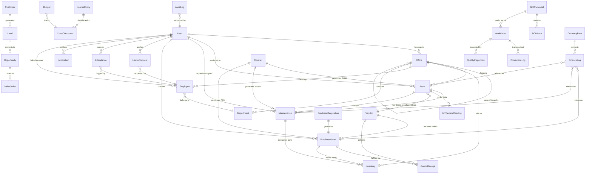

# 03: Database Models — CoreOps ERP v3.0

> **Version**: 3.0 — Aspirational Architecture Blueprint
>
> All schemas are **Mongoose (MongoDB)**. Every model has `timestamps: true` unless noted. Organization scoping uses `officeId` referencing the `Office` model. All monetary fields use the **Multi-Currency Pattern** (amount + currency + exchangeRate).

---

## 3.1 Model Relationship Diagram



---

## 3.2 Schema Design Patterns

> These cross-cutting patterns apply across all models. Understanding them is essential before reading individual schemas.

### Pattern 1: Organization Scoping

Every tenant-scoped model includes `officeId` to enforce multi-organization data isolation.

```javascript
officeId: { type: ObjectId, ref: 'Office', required: true, index: true }
```

**Middleware enforcement**: All `find*` queries automatically inject `officeId` filter from the authenticated user's context. `SUPER_ADMIN` bypasses this filter for cross-org access.

### Pattern 2: GUAI Auto-Generation

The **Global Unique Asset Identifier** pattern uses the `Counter` model to generate human-readable sequential IDs:

```
Format: CORP-{countryCode}-{locationCode}-{typeCode}-{sequence}
Example: CORP-IN-SUR-LAPT-001
```

Applied to: `Asset` (GUAI), `Inventory` (SKU), `Maintenance` (ticketNumber), `PurchaseOrder` (poNumber), `Vendor` (vendorCode), `FinanceLog` (transactionNumber).

### Pattern 3: Soft Delete

Instead of permanent deletion, records are marked inactive:

```javascript
isActive:  { type: Boolean, default: true, index: true },
deletedAt: { type: Date, default: null },
deletedBy: { type: ObjectId, ref: 'User', default: null }
```

All `find*` queries exclude `isActive: false` by default via Mongoose middleware. TTL index on `deletedAt` auto-purges after configurable retention period (default: 90 days → archive collection).

### Pattern 4: Audit Trail

Two-level audit strategy:

| Level | Mechanism | Use Case |
|-------|-----------|----------|
| **Embedded** | `history[]` array on the document | Quick access to recent changes (max 50 entries) |
| **Dedicated** | `AuditLog` collection | Full compliance trail, searchable, immutable |

### Pattern 5: Multi-Currency

All monetary fields store both original and base-currency values:

```javascript
amount:       { type: Number, required: true, min: 0 },
currency:     { type: String, default: 'INR', uppercase: true, maxlength: 3 },
exchangeRate: { type: Number, default: 1 },        // rate at time of transaction
baseAmount:   { type: Number }                      // auto-calculated: amount × exchangeRate
```

### Pattern 6: Approval Workflow

Models requiring approval share this embedded structure:

```javascript
approval: {
  status:       { type: String, enum: ['PENDING','APPROVED','REJECTED','ESCALATED'], default: 'PENDING' },
  approvedBy:   { type: ObjectId, ref: 'User' },
  approvalDate: { type: Date },
  notes:        { type: String, maxlength: 1000 },
  escalatedTo:  { type: ObjectId, ref: 'User' },
  history:      [{ action: String, by: ObjectId, date: Date, notes: String }]
}
```

Applied to: `Maintenance`, `PurchaseRequisition`, `PurchaseOrder`, `LeaveRequest`, `FinanceLog`.

### Pattern 7: Versioning

Documents that evolve over time use version tracking:

```javascript
version:        { type: Number, default: 1 },
versionHistory: [{
  version:    Number,
  changedBy:  { type: ObjectId, ref: 'User' },
  changedAt:  Date,
  changeSummary: String,
  snapshot:   { type: Schema.Types.Mixed }    // frozen copy of previous version
}]
```

Applied to: `BillOfMaterial`, `Budget`, `SalesOrder`.

### Pattern 8: Embedding vs Referencing Decision Matrix

| Criteria | Embed | Reference |
|----------|-------|-----------|
| Read together >80% of the time | ✅ | |
| Sub-document < 16KB | ✅ | |
| Unbounded growth potential | | ✅ |
| Shared across multiple parents | | ✅ |
| Independently queryable | | ✅ |
| Write-heavy sub-data | | ✅ |

---

## 3.3 Core Platform Models (6 Models)

---

### User
**Collection**: `users` · **Phase**: 1 · **~280 lines**

```javascript
{
  // ── Identity ──
  name:               { type: String, required: true, trim: true, maxlength: 100 },
  email:              { type: String, required: true, unique: true, lowercase: true, trim: true },
  password:           { type: String, required: true, minlength: 8, select: false },
  role:               { type: String, enum: ['SUPER_ADMIN','ADMIN','MANAGER','TECHNICIAN','STAFF','VIEWER'], default: 'STAFF' },
  officeId:           { type: ObjectId, ref: 'Office', default: null },

  // ── Permissions (auto-set by role on pre-save) ──
  permissions: {
    canApproveTickets:    Boolean,
    canManageAssets:      Boolean,
    canManageInventory:   Boolean,
    canViewFinancials:    Boolean,
    canManageUsers:       Boolean,
    canManageVendors:     Boolean,
    approvalLimit:        { type: Number },    // -1 = unlimited, 0 = none
  },

  // ── Security ──
  lastLogin:            { type: Date },
  failedLoginAttempts:  { type: Number, default: 0 },
  isLocked:             { type: Boolean, default: false },
  lockUntil:            { type: Date },
  passwordChangedAt:    { type: Date },
  passwordResetToken:   { type: String, select: false },
  passwordResetExpires: { type: Date, select: false },
  inviteToken:          { type: String, select: false },
  inviteTokenExpires:   { type: Date, select: false },

  // ── MFA ──
  mfa: {
    enabled:          { type: Boolean, default: false },
    method:           { type: String, enum: ['TOTP','SMS','EMAIL'], default: 'TOTP' },
    secret:           { type: String, select: false },
    recoveryCodes:    { type: [String], select: false },
    verifiedAt:       { type: Date },
  },

  // ── Sessions ──
  activeSessions: [{
    token:        { type: String, select: false },
    device:       String,
    ip:           String,
    userAgent:    String,
    lastActive:   Date,
    createdAt:    Date,
  }],

  // ── Profile ──
  phone:              { type: String, trim: true },
  avatar:             { type: String },
  isActive:           { type: Boolean, default: true },

  // ── Preferences ──
  preferences: {
    theme:          { type: String, enum: ['light','dark','system'], default: 'system' },
    language:       { type: String, default: 'en' },
    timezone:       { type: String, default: 'Asia/Kolkata', maxlength: 50 },
    notifications:  {
      email:   { type: Boolean, default: true },
      inApp:   { type: Boolean, default: true },
      push:    { type: Boolean, default: false },
    },
    dashboardLayout: { type: Schema.Types.Mixed },
  },
}
```

| Indexes | Fields |
|---------|--------|
| Unique | `email` |
| Compound | `{ role, officeId }`, `{ isActive, officeId }` |
| Single | `officeId` |

| Hook / Method | Description |
|----------------|-------------|
| **Pre-save** | Bcrypt password (12 rounds), auto-set permissions by role |
| `comparePassword()` | Verify password against hash |
| `canApproveAmount(n)` | Check monetary approval authority |
| `updateLastLogin()` | Timestamped login tracking |
| `incFailedLogin()` | Progressive lockout (5 fails → 15min lock, 10 → 1hr, 15 → 24hr) |
| `changedPasswordAfter(t)` | JWT invalidation check |

---

### Office (Organization)
**Collection**: `offices` · **Phase**: 1 · **~165 lines**

```javascript
{
  name:               { type: String, required: true, trim: true, maxlength: 100 },
  code:               { type: String, required: true, unique: true, uppercase: true, minlength: 2, maxlength: 10 },
  type:               { type: String, enum: ['headquarters','regional_office','branch','warehouse','factory'], default: 'branch' },

  // ── Hierarchy ──
  parentOrganization: { type: ObjectId, ref: 'Office', default: null },
  path:               { type: String },                  // materialized path: "/hq-id/region-id/branch-id"
  level:              { type: Number, default: 0 },      // depth in hierarchy

  // ── Address ──
  address: {
    street: String, city: String, state: String, country: String,
    postalCode: String,
    coordinates: { latitude: Number, longitude: Number },
  },

  // ── Contact ──
  contactInfo: {
    phone: String,
    email: { type: String, lowercase: true },
    website: String,
  },

  // ── Currency & Locale ──
  baseCurrency:     { type: String, default: 'INR', uppercase: true },
  countryCode:      { type: String, uppercase: true, minlength: 2, maxlength: 3 },
  locationCode:     { type: String, uppercase: true, minlength: 2, maxlength: 5 },

  // ── Business Settings ──
  settings: {
    maintenanceApprovalThreshold: { type: Number, default: 5000 },
    autoApproveUnder:             { type: Number, default: 1000 },
    lowStockThreshold:            { type: Number, default: 10 },
    defaultDepreciationMethod:    { type: String, enum: ['straight_line','declining_balance','units_of_production'], default: 'straight_line' },
    fiscalYearStart:              { type: Number, default: 4 },    // April (month 1-12)
    workingDays:                  { type: [String], default: ['MON','TUE','WED','THU','FRI'] },
    defaultShift:                 { type: String, default: '09:00-18:00' },
  },

  isActive:           { type: Boolean, default: true },
}
```

| Indexes | Fields |
|---------|--------|
| Unique | `code` |
| Compound | `{ name, address.country }`, `{ type, isActive }` |
| Single | `parentOrganization`, `path` |

| Hook / Method | Description |
|----------------|-------------|
| **Pre-save** | Auto-set `path` from parent chain, sync `locationCode` from `code` |
| **Virtual** `childOffices` | Populated via `parentOrganization` |
| **Virtual** `fullAddress` | Computed formatted string |
| **Static** `getHierarchy(id)` | Recursive tree builder |
| **Static** `getAllDescendants(id)` | Flat list of all child office IDs |

---

### Counter
**Collection**: `counters` · **Phase**: 1

```javascript
{
  _id:        { type: String },                    // e.g., "ASSET-CORP-IN-SUR-LAPT"
  sequence:   { type: Number, default: 0 },
  prefix:     { type: String },
  format:     { type: String },                    // e.g., "{prefix}-{seq:4}"
  lastReset:  { type: Date },
  resetFrequency: { type: String, enum: ['NEVER','DAILY','MONTHLY','YEARLY'], default: 'NEVER' },
}
```

| Static Method | Description |
|---------------|-------------|
| `getNextSequence(key, opts)` | Atomic `findOneAndUpdate` with `$inc`, returns formatted ID |

---

### CurrencyRate
**Collection**: `currencyrates` · **Phase**: 1

```javascript
{
  // ── Currency Pair ──
  baseCurrency:   { type: String, required: true, uppercase: true, maxlength: 3 },  // ISO 4217: USD, INR, EUR, GBP
  targetCurrency: { type: String, required: true, uppercase: true, maxlength: 3 },
  rate:           { type: Number, required: true, min: 0 },
  inverseRate:    { type: Number, min: 0 },  // Pre-calculated 1/rate for fast reverse lookup

  // ── Source & Provider ──
  source:         { type: String, enum: ['MANUAL','EXCHANGERATE_API','OPENEXCHANGE','ECB','FIXER','CURRENCY_BEACON'], default: 'MANUAL' },
  provider: {
    name:         { type: String },          // Provider display name
    apiKey:       { type: String, select: false },  // Encrypted API key
    baseUrl:      { type: String },          // e.g., https://v6.exchangerate-api.com/v6/
  },

  // ── Real-Time Auto-Refresh ──
  autoRefresh: {
    enabled:      { type: Boolean, default: false },
    intervalMs:   { type: Number, default: 3600000 },  // Default: 1 hour
    lastFetched:  { type: Date },
    nextFetch:    { type: Date },
    cronExpression: { type: String, default: '0 */1 * * *' },  // BullMQ cron: every hour
  },

  // ── Metadata ──
  effectiveDate:  { type: Date, required: true, default: Date.now },
  expiresAt:      { type: Date },
  metadata: {
    fetchDurationMs: { type: Number },       // API response time
    reliability:     { type: Number, min: 0, max: 100, default: 100 },  // Provider uptime %
    lastError:       { type: String },
    consecutiveFailures: { type: Number, default: 0 },
  },

  officeId:       { type: ObjectId, ref: 'Office' },  // Org-scoped if needed
}
```

| Indexes | Fields |
|---------|--------|
| Compound unique | `{ baseCurrency, targetCurrency, effectiveDate }` |
| Compound | `{ baseCurrency, targetCurrency, source }` |
| TTL | `expiresAt` (auto-delete stale rates) |
| Single | `autoRefresh.nextFetch` (for BullMQ job picker) |

| Static Method | Description |
|---------------|-------------|
| `getRate(from, to, date?)` | Returns closest rate for the given date |
| `convert(amount, from, to, date?)` | Full conversion with rate lookup |
| `getLatestRates(baseCurrency)` | Returns all target rates for a base currency |
| `refreshFromProvider(provider)` | Fetches latest rates from external API and upserts |
| `getHistorical(from, to, startDate, endDate)` | Historical rate series for charts |

> **Real-Time Fetch Flow**: BullMQ repeatable job (`currency:refresh`) runs on `autoRefresh.cronExpression`. On each tick: call provider API → upsert rates → emit `currency:rateUpdated` WebSocket event → update `lastFetched` + `nextFetch`. On failure: increment `consecutiveFailures`, log `lastError`, switch to fallback provider after 3 failures.

---

### Notification
**Collection**: `notifications` · **Phase**: 1

```javascript
{
  userId:       { type: ObjectId, ref: 'User', required: true, index: true },
  type:         { type: String, enum: [
    'TICKET_ASSIGNED','TICKET_UPDATED','TICKET_COMMENT','TICKET_SLA_WARNING',
    'PO_APPROVED','PO_REJECTED','PO_RECEIVED',
    'STOCK_LOW','STOCK_TRANSFER',
    'LEAVE_APPROVED','LEAVE_REJECTED',
    'APPROVAL_PENDING','APPROVAL_ESCALATED',
    'SYSTEM_ALERT','AI_INSIGHT',
  ], required: true },
  title:        { type: String, required: true, maxlength: 200 },
  message:      { type: String, maxlength: 1000 },
  priority:     { type: String, enum: ['LOW','NORMAL','HIGH','URGENT'], default: 'NORMAL' },

  // ── Reference ──
  entityType:   { type: String },                  // 'Asset', 'Maintenance', 'PurchaseOrder', etc.
  entityId:     { type: ObjectId },
  actionUrl:    { type: String },                  // deep-link path, e.g., "/maintenance/MT-2024-0089"

  // ── State ──
  isRead:       { type: Boolean, default: false },
  readAt:       { type: Date },
  isArchived:   { type: Boolean, default: false },

  // ── Delivery ──
  channels: {
    inApp:   { type: Boolean, default: true },
    email:   { type: Boolean, default: false },
    push:    { type: Boolean, default: false },
  },
  deliveredVia: [{ channel: String, deliveredAt: Date, status: String }],
}
```

| Indexes | Fields |
|---------|--------|
| Compound | `{ userId, isRead, createdAt: -1 }` |
| TTL | `createdAt` (auto-delete after 90 days) |

---

### AuditLog
**Collection**: `auditlogs` · **Phase**: 1

```javascript
{
  // ── Who ──
  userId:       { type: ObjectId, ref: 'User', required: true },
  userEmail:    { type: String },                  // denormalized for query speed
  userRole:     { type: String },
  officeId:     { type: ObjectId, ref: 'Office' },

  // ── What ──
  action:       { type: String, enum: [
    'CREATE','READ','UPDATE','DELETE','EXPORT','IMPORT','LOGIN','LOGOUT',
    'APPROVE','REJECT','ESCALATE','ASSIGN','STATUS_CHANGE',
    'PASSWORD_CHANGE','ROLE_CHANGE','PERMISSION_CHANGE',
  ], required: true },
  entityType:   { type: String, required: true },  // 'Asset', 'User', 'PurchaseOrder', etc.
  entityId:     { type: ObjectId },
  entityName:   { type: String },                  // human-readable identifier

  // ── Details ──
  changes: {
    before: { type: Schema.Types.Mixed },          // previous field values
    after:  { type: Schema.Types.Mixed },          // new field values
    diff:   [{ field: String, from: Schema.Types.Mixed, to: Schema.Types.Mixed }],
  },
  metadata: {
    ip:         String,
    userAgent:  String,
    requestId:  String,
    endpoint:   String,
    method:     String,
  },

  // ── Compliance ──
  severity:     { type: String, enum: ['INFO','WARNING','CRITICAL'], default: 'INFO' },
  isCompliance: { type: Boolean, default: false },
}
```

| Indexes | Fields |
|---------|--------|
| Compound | `{ entityType, entityId, createdAt: -1 }` |
| Compound | `{ userId, createdAt: -1 }` |
| Compound | `{ action, createdAt: -1 }` |
| Single | `officeId`, `severity` |

> **Immutability**: AuditLog documents have no `update` or `delete` operations exposed. Write-once, read-many. Capped collection or time-based archival to cold storage after 1 year.

---

## 3.4 Asset & Maintenance Models (4 Models)

---

### Asset
**Collection**: `assets` · **Phase**: 1 · **~400 lines**

```javascript
{
  // ── Identity ──
  guai:             { type: String, unique: true, uppercase: true, immutable: true },
  name:             { type: String, required: true, trim: true, maxlength: 200 },
  category:         { type: String, required: true, uppercase: true,
                      enum: ['LAPTOP','COMPUTER','FURNITURE','VEHICLE','EQUIPMENT','PHONE',
                             'PRINTER','SERVER','NETWORK','MACHINERY','HVAC','ELECTRICAL',
                             'PLUMBING','SAFETY','MEDICAL','OTHER'] },
  subcategory:      { type: String, trim: true, maxlength: 50 },
  model:            { type: String, trim: true, maxlength: 100 },
  manufacturer:     { type: String, trim: true, maxlength: 100 },
  serialNumber:     { type: String, trim: true, maxlength: 100 },
  description:      { type: String, trim: true, maxlength: 2000 },

  // ── Purchase Info ──
  purchaseInfo: {
    vendor:         { type: ObjectId, ref: 'Vendor' },
    purchaseDate:   { type: Date, default: Date.now },
    purchasePrice:  { type: Number, min: 0 },
    currency:       { type: String, default: 'INR', uppercase: true },
    exchangeRate:   { type: Number, default: 1 },
    invoiceNumber:  { type: String },
    warranty: {
      startDate: Date, endDate: Date,
      terms:     { type: String, maxlength: 500 },
      provider:  String,
      contractNumber: String,
    },
  },

  // ── Depreciation ──
  depreciation: {
    method:       { type: String, enum: ['straight_line','declining_balance','units_of_production'], default: 'straight_line' },
    usefulLife:   { type: Number, min: 0 },          // years
    salvageValue: { type: Number, default: 0, min: 0 },
    totalUnits:   { type: Number },                  // for units_of_production
    unitsUsed:    { type: Number, default: 0 },
  },

  // ── Location & Assignment ──
  location: {
    building: String, floor: String, room: String,
    assignedTo: { type: ObjectId, ref: 'User' },
    assignedDate: Date,
    coordinates: { latitude: Number, longitude: Number },
  },
  officeId:         { type: ObjectId, ref: 'Office', required: true },

  // ── Status & Health ──
  status:           { type: String, uppercase: true,
                      enum: ['ACTIVE','MAINTENANCE','DECOMMISSIONED','LOST','SOLD','RETIRED','IN_TRANSIT','DISPOSED'],
                      default: 'ACTIVE' },
  healthScore:      { type: Number, min: 0, max: 100, default: 100 },
  criticality:      { type: String, enum: ['LOW','MEDIUM','HIGH','CRITICAL'], default: 'MEDIUM' },

  // ── IoT Integration ──
  iot: {
    enabled:     { type: Boolean, default: false },
    deviceId:    { type: String },
    sensorTypes: [{ type: String, enum: ['TEMPERATURE','VIBRATION','PRESSURE','HUMIDITY','ENERGY','RUNTIME'] }],
    lastReading: { type: Date },
    alertThresholds: { type: Schema.Types.Mixed },
  },

  // ── Specifications ──
  specifications:   { type: Map, of: String },       // flexible key-value pairs

  // ── Maintenance History (embedded, max 50) ──
  maintenanceHistory: [{
    date:  Date,
    type:  { type: String, maxlength: 50 },
    cost:  { type: Number, min: 0 },
    notes: { type: String, maxlength: 500 },
    ticketRef: { type: ObjectId, ref: 'Maintenance' },
  }],

  // ── Media ──
  qrCode:           { type: String, maxlength: 50000 },
  images:           { type: [String], validate: { validator: v => v.length <= 10 } },
  documents:        [{ name: String, url: String, type: String, uploadedAt: Date }],
  notes:            { type: String, trim: true, maxlength: 2000 },
  customFields:     { type: Map, of: Schema.Types.Mixed },

  // ── Soft Delete ──
  isActive:         { type: Boolean, default: true },
  deletedAt:        { type: Date },
  deletedBy:        { type: ObjectId, ref: 'User' },
}
```

| Indexes | Fields |
|---------|--------|
| Unique | `guai` |
| Compound | `{ officeId, status }`, `{ category, officeId }`, `{ officeId, createdAt: -1 }` |
| Single | `location.assignedTo`, `purchaseInfo.vendor`, `serialNumber` (sparse) |

| Hook / Method | Description |
|----------------|-------------|
| **Pre-save** | Auto-generate GUAI via Counter, sync legacy fields |
| **Virtual** `currentBookValue` | Depreciation calculation based on method |
| **Virtual** `isUnderWarranty` | Boolean from warranty dates |
| **Virtual** `warrantyDaysRemaining` | Computed |
| **Virtual** `totalMaintenanceCost` | Sum of maintenanceHistory costs |
| `calculateDepreciation()` | Returns { bookValue, accumulatedDep, annualDep } |
| `addMaintenanceRecord(data)` | Push to history, enforce max 50 |
| `updateHealthScore()` | Recalculate from maintenance frequency + IoT data |

---

### Maintenance
**Collection**: `maintenances` · **Phase**: 2 · **~280 lines**

```javascript
{
  // ── Identity ──
  ticketNumber:     { type: String, unique: true, uppercase: true },   // MT-YYYYMMDD-XXXX
  assetId:          { type: ObjectId, ref: 'Asset', required: true },
  officeId:         { type: ObjectId, ref: 'Office', required: true },
  title:            { type: String, required: true, trim: true, maxlength: 200 },
  description:      { type: String, trim: true, maxlength: 2000 },

  // ── Classification ──
  type:             { type: String, enum: ['CORRECTIVE','PREVENTIVE','PREDICTIVE','EMERGENCY'], default: 'CORRECTIVE' },
  priority:         { type: String, enum: ['LOW','MEDIUM','HIGH','CRITICAL'], default: 'MEDIUM' },
  category:         { type: String, enum: ['MECHANICAL','ELECTRICAL','PLUMBING','HVAC','IT','SAFETY','OTHER'] },

  // ── SLA ──
  sla: {
    responseDeadline:   Date,
    resolutionDeadline: Date,
    respondedAt:        Date,
    resolvedAt:         Date,
    responseBreached:   { type: Boolean, default: false },
    resolutionBreached: { type: Boolean, default: false },
  },

  // ── Costs ──
  estimatedCost:    { type: Number, min: 0 },
  actualCost:       { type: Number, min: 0 },
  currency:         { type: String, default: 'INR', uppercase: true },

  // ── Repair vs Replace ──
  decision:         { type: String, enum: ['REPAIR','REPLACE'] },
  algorithmResult: {
    ratio: Number, recommendation: String, bookValue: Number,
    repairCost: Number, replacementCost: Number, threshold: Number,
    savingsAmount: Number,
  },

  // ── Approval (Pattern 6) ──
  approval: {
    status:       { type: String, enum: ['PENDING','APPROVED','REJECTED','ESCALATED','AUTO_APPROVED'], default: 'PENDING' },
    approvedBy:   { type: ObjectId, ref: 'User' },
    approvalDate: Date,
    notes:        { type: String, maxlength: 1000 },
  },

  // ── Assignment ──
  assignedTo:       { type: ObjectId, ref: 'User' },
  assignedDate:     Date,
  requestedBy:      { type: ObjectId, ref: 'User', required: true },
  reportedDate:     { type: Date, default: Date.now },

  // ── Spare Parts ──
  sparePartsUsed: [{
    inventoryId:  { type: ObjectId, ref: 'Inventory' },
    name:         String,
    quantityUsed: { type: Number, min: 1 },
    unitCost:     { type: Number, min: 0 },
  }],

  // ── Work Log ──
  workLog: [{
    technician: { type: ObjectId, ref: 'User' },
    startTime:  Date, endTime: Date,
    hoursWorked: Number,
    notes:      { type: String, maxlength: 500 },
  }],

  // ── Checklist ──
  checklist: [{
    item:       { type: String, maxlength: 200 },
    completed:  { type: Boolean, default: false },
    completedBy: { type: ObjectId, ref: 'User' },
    completedAt: Date,
  }],

  // ── Status ──
  status:           { type: String,
    enum: ['REQUESTED','PENDING_APPROVAL','APPROVED','IN_PROGRESS','PENDING_PARTS',
           'ON_HOLD','COMPLETED','CLOSED','CANCELLED','REJECTED'],
    default: 'REQUESTED' },
  resolution:       { type: String, trim: true, maxlength: 2000 },
  completedDate:    Date,
  closedDate:       Date,

  // ── Failure Analysis ──
  failureMode:      { type: String, maxlength: 200 },
  rootCause:        { type: String, maxlength: 500 },
  correctiveAction: { type: String, maxlength: 500 },

  attachments:      [{ name: String, url: String, type: { type: String, enum: ['BEFORE','AFTER','REPORT','OTHER'] }, uploadedAt: Date }],
  isActive:         { type: Boolean, default: true },
}
```

| Indexes | Fields |
|---------|--------|
| Unique | `ticketNumber` |
| Compound | `{ assetId, status }`, `{ officeId, status, priority }`, `{ assignedTo, status }`, `{ requestedBy, reportedDate: -1 }` |
| Single | `reportedDate: -1` |

| Hook / Method | Description |
|----------------|-------------|
| **Pre-save** | Generate ticketNumber, auto-calculate SLA deadlines from priority, auto-approve if under threshold |
| **Virtual** `totalPartsCost` | Sum of sparePartsUsed costs |
| **Virtual** `totalHoursWorked` | Sum of workLog hours |
| **Virtual** `resolutionTime` | Days from reportedDate to completedDate |
| **Virtual** `isOverdue` | Check SLA breach |
| `runRepairReplaceAlgorithm()` | Cost analysis with recommendation |
| `escalate(toUserId)` | Escalate approval to higher authority |

---

### PreventiveSchedule
**Collection**: `preventiveschedules` · **Phase**: 3

```javascript
{
  name:             { type: String, required: true, maxlength: 200 },
  assetId:          { type: ObjectId, ref: 'Asset', required: true },
  officeId:         { type: ObjectId, ref: 'Office', required: true },

  // ── Frequency ──
  frequency:        { type: String, enum: ['DAILY','WEEKLY','BIWEEKLY','MONTHLY','QUARTERLY','SEMI_ANNUAL','ANNUAL','CUSTOM'] },
  cronExpression:   { type: String },                // for CUSTOM: "0 9 * * 1" (every Monday 9AM)
  intervalDays:     { type: Number },                // alternative to cron

  // ── Trigger ──
  triggerType:      { type: String, enum: ['TIME_BASED','METER_BASED','CONDITION_BASED'], default: 'TIME_BASED' },
  meterThreshold:   { type: Number },                // trigger when meter reaches this value
  meterUnit:        { type: String },                // 'hours', 'km', 'cycles'

  // ── Template ──
  ticketTemplate: {
    title:          String,
    type:           { type: String, default: 'PREVENTIVE' },
    priority:       { type: String, default: 'MEDIUM' },
    estimatedCost:  Number,
    estimatedHours: Number,
    assignTo:       { type: ObjectId, ref: 'User' },
    checklist:      [{ item: String }],
    description:    String,
  },

  // ── Tracking ──
  lastExecuted:     Date,
  nextDue:          Date,
  executionCount:   { type: Number, default: 0 },
  lastTicketId:     { type: ObjectId, ref: 'Maintenance' },
  autoCreateDaysBefore: { type: Number, default: 3 },

  // ── Notifications ──
  notifyBefore:     { type: Number, default: 7 },   // days before due
  notifyUsers:      [{ type: ObjectId, ref: 'User' }],

  isActive:         { type: Boolean, default: true },
}
```

---

### IoTSensorReading
**Collection**: `iotsensorreadings` · **Phase**: 7 (CoreAI)

```javascript
{
  assetId:          { type: ObjectId, ref: 'Asset', required: true, index: true },
  deviceId:         { type: String, required: true },
  officeId:         { type: ObjectId, ref: 'Office', required: true },

  sensorType:       { type: String, enum: ['TEMPERATURE','VIBRATION','PRESSURE','HUMIDITY','ENERGY','RUNTIME','FLOW','NOISE'], required: true },
  value:            { type: Number, required: true },
  unit:             { type: String, required: true },    // '°C', 'mm/s', 'kPa', '%', 'kWh', 'hrs'
  quality:          { type: String, enum: ['GOOD','SUSPECT','BAD'], default: 'GOOD' },

  // ── Alert ──
  isAnomaly:        { type: Boolean, default: false },
  anomalyScore:     { type: Number, min: 0, max: 1 },
  alertTriggered:   { type: Boolean, default: false },

  timestamp:        { type: Date, required: true, default: Date.now },
}
```

| Indexes | Fields |
|---------|--------|
| Compound | `{ assetId, sensorType, timestamp: -1 }` |
| TTL | `timestamp` (auto-delete raw readings after 90 days, aggregated data retained) |

> **Time-Series Optimization**: This collection uses MongoDB's time-series collection feature (`timeseries: { timeField: 'timestamp', metaField: 'assetId', granularity: 'minutes' }`) for optimal storage and query performance.

---

## 3.5 Inventory & Warehouse Models (4 Models)

---

### Inventory
**Collection**: `inventories` · **Phase**: 1 · **~200 lines**

```javascript
{
  // ── Identity ──
  sku:              { type: String, unique: true, uppercase: true },   // auto-generated
  name:             { type: String, required: true, trim: true, maxlength: 200 },
  type:             { type: String, enum: ['PRODUCT','SPARE_PART','RAW_MATERIAL','CONSUMABLE','TOOL'], required: true },
  category:         { type: String, trim: true, maxlength: 100 },
  subcategory:      { type: String, trim: true, maxlength: 100 },
  description:      { type: String, trim: true, maxlength: 2000 },

  // ── Stock ──
  quantity:         { type: Number, required: true, default: 0, min: 0 },
  unit:             { type: String, default: 'pcs', maxlength: 20 },
  reorderPoint:     { type: Number, default: 10 },
  safetyStock:      { type: Number, default: 5 },
  maxStock:         { type: Number },
  avgDailyDemand:   { type: Number, default: 0 },
  leadTimeDays:     { type: Number, default: 7 },

  // ── Warehouse Location ──
  warehouseLocation: { type: ObjectId, ref: 'WarehouseLocation' },
  officeId:         { type: ObjectId, ref: 'Office', required: true },

  // ── Tracking ──
  trackingMethod:   { type: String, enum: ['NONE','LOT','SERIAL','BATCH'], default: 'NONE' },
  lots: [{
    lotNumber:    { type: String },
    batchNumber:  { type: String },
    quantity:     Number,
    manufacturedDate: Date,
    expiryDate:   Date,
    supplier:     { type: ObjectId, ref: 'Vendor' },
    receivedDate: Date,
  }],
  serialNumbers: [{
    serial:       { type: String },
    status:       { type: String, enum: ['AVAILABLE','IN_USE','DEFECTIVE','RETURNED'], default: 'AVAILABLE' },
    assignedTo:   { type: ObjectId, ref: 'Asset' },
    warrantyEnd:  Date,
  }],

  // ── Pricing ──
  unitCost:         { type: Number, min: 0 },
  currency:         { type: String, default: 'INR', uppercase: true },
  sellingPrice:     { type: Number, min: 0 },
  costingMethod:    { type: String, enum: ['FIFO','LIFO','WEIGHTED_AVG','STANDARD'], default: 'WEIGHTED_AVG' },

  // ── Vendor ──
  preferredVendor:  { type: ObjectId, ref: 'Vendor' },
  alternateVendors: [{ type: ObjectId, ref: 'Vendor' }],

  // ── Media ──
  images:           [String],
  barcode:          { type: String },
  specifications:   { type: Map, of: String },

  // ── Stock Status ──
  stockStatus:      { type: String, enum: ['IN_STOCK','LOW_STOCK','OUT_OF_STOCK','OVERSTOCK','DISCONTINUED'],
                      default: 'IN_STOCK' },
  lastRestocked:    Date,
  lastStockCheck:   Date,

  isActive:         { type: Boolean, default: true },
}
```

| Indexes | Fields |
|---------|--------|
| Unique | `sku` |
| Compound | `{ officeId, type }`, `{ officeId, stockStatus }`, `{ category, officeId }` |
| Single | `preferredVendor`, `barcode` (sparse) |

| Hook / Method | Description |
|----------------|-------------|
| **Pre-save** | Auto-generate SKU, auto-calculate `stockStatus` from quantity vs thresholds |
| `adjustStock(qty, reason, userId)` | Stock adjustment with audit trail |
| `canFulfill(requiredQty)` | Check availability |
| `getExpiringLots(withinDays)` | Returns lots expiring soon (FEFO logic) |
| `calculateReorderPoint()` | Formula: (avgDailyDemand × leadTimeDays) + safetyStock |

---

### WarehouseLocation
**Collection**: `warehouselocations` · **Phase**: 4

```javascript
{
  officeId:         { type: ObjectId, ref: 'Office', required: true },
  code:             { type: String, required: true, uppercase: true },   // "WH1-A-03-R2-B5"
  name:             { type: String, maxlength: 100 },

  // ── Hierarchy ──
  type:             { type: String, enum: ['WAREHOUSE','ZONE','AISLE','RACK','SHELF','BIN'], required: true },
  parentLocation:   { type: ObjectId, ref: 'WarehouseLocation' },
  path:             { type: String },                // materialized: "/wh-id/zone-id/aisle-id/rack-id"

  // ── Capacity ──
  maxCapacity:      { type: Number },
  currentOccupancy: { type: Number, default: 0 },
  capacityUnit:     { type: String, default: 'units' },

  // ── Properties ──
  storageCondition: { type: String, enum: ['STANDARD','COLD','FROZEN','HAZARDOUS','CLIMATE_CONTROLLED'], default: 'STANDARD' },
  isPickable:       { type: Boolean, default: true },

  isActive:         { type: Boolean, default: true },
}
```

| Indexes | Fields |
|---------|--------|
| Compound unique | `{ officeId, code }` |

---

### StockTransfer
**Collection**: `stocktransfers` · **Phase**: 4

```javascript
{
  transferNumber:   { type: String, unique: true, uppercase: true },   // ST-YYYYMMDD-XXXX
  fromOffice:       { type: ObjectId, ref: 'Office', required: true },
  toOffice:         { type: ObjectId, ref: 'Office', required: true },
  fromLocation:     { type: ObjectId, ref: 'WarehouseLocation' },
  toLocation:       { type: ObjectId, ref: 'WarehouseLocation' },

  items: [{
    inventoryId:    { type: ObjectId, ref: 'Inventory', required: true },
    quantity:       { type: Number, required: true, min: 1 },
    lotNumber:      String,
    serialNumbers:  [String],
  }],

  status:           { type: String, enum: ['DRAFT','PENDING','IN_TRANSIT','RECEIVED','CANCELLED'], default: 'DRAFT' },
  requestedBy:      { type: ObjectId, ref: 'User', required: true },
  approvedBy:       { type: ObjectId, ref: 'User' },
  receivedBy:       { type: ObjectId, ref: 'User' },

  requestedDate:    { type: Date, default: Date.now },
  shippedDate:      Date,
  receivedDate:     Date,
  estimatedArrival: Date,

  notes:            { type: String, maxlength: 1000 },
  trackingNumber:   String,
}
```

---

### StockAdjustment
**Collection**: `stockadjustments` · **Phase**: 3

```javascript
{
  adjustmentNumber: { type: String, unique: true, uppercase: true },
  officeId:         { type: ObjectId, ref: 'Office', required: true },
  inventoryId:      { type: ObjectId, ref: 'Inventory', required: true },

  type:             { type: String, enum: ['INCREASE','DECREASE','COUNT','WRITE_OFF','RETURN'], required: true },
  reason:           { type: String, enum: ['PHYSICAL_COUNT','DAMAGE','THEFT','EXPIRY','CORRECTION','RETURN','OTHER'], required: true },

  previousQty:      { type: Number, required: true },
  adjustedQty:      { type: Number, required: true },
  difference:       { type: Number },               // auto-calculated
  costImpact:       { type: Number },               // auto-calculated: difference × unitCost

  adjustedBy:       { type: ObjectId, ref: 'User', required: true },
  approvedBy:       { type: ObjectId, ref: 'User' },
  notes:            { type: String, maxlength: 1000 },
  attachments:      [String],
}
```

---

## 3.6 Procurement Models (4 Models)

---

### Vendor
**Collection**: `vendors` · **Phase**: 2 · **~180 lines**

```javascript
{
  // ── Identity ──
  vendorCode:       { type: String, unique: true, uppercase: true },   // auto-generated: VND-XXXX
  name:             { type: String, required: true, trim: true, maxlength: 200 },
  type:             { type: String, enum: ['SUPPLIER','CONTRACTOR','SERVICE_PROVIDER','MANUFACTURER','DISTRIBUTOR'], required: true },
  category:         { type: String, trim: true, maxlength: 100 },
  officeId:         { type: ObjectId, ref: 'Office', required: true },

  // ── Contact ──
  contact: {
    primaryName:    { type: String, maxlength: 100 },
    email:          { type: String, lowercase: true },
    phone:          String,
    alternatePhone: String,
    website:        String,
  },
  address: {
    street: String, city: String, state: String, country: String,
    postalCode: String,
  },

  // ── Financial ──
  taxId:            { type: String },                // GST / VAT / TIN
  currency:         { type: String, default: 'INR', uppercase: true },
  paymentTerms:     { type: String, enum: ['NET_15','NET_30','NET_45','NET_60','NET_90','COD','ADVANCE'], default: 'NET_30' },
  bankDetails: {
    bankName: String, accountNumber: String, ifscCode: String,
    swiftCode: String, routingNumber: String,
  },

  // ── Performance Scorecard ──
  scorecard: {
    qualityScore:    { type: Number, min: 0, max: 100, default: 50 },
    deliveryScore:   { type: Number, min: 0, max: 100, default: 50 },
    pricingScore:    { type: Number, min: 0, max: 100, default: 50 },
    responseScore:   { type: Number, min: 0, max: 100, default: 50 },
    overallRating:   { type: Number, min: 0, max: 100, default: 50 },
    totalOrders:     { type: Number, default: 0 },
    onTimeDeliveryRate: { type: Number, default: 0 },
    defectRate:      { type: Number, default: 0 },
    lastEvaluated:   Date,
    evaluationHistory: [{
      date: Date, evaluatedBy: { type: ObjectId, ref: 'User' },
      scores: { quality: Number, delivery: Number, pricing: Number, response: Number },
      notes: String,
    }],
  },

  // ── Compliance ──
  certifications:   [{ name: String, issuedBy: String, validUntil: Date, documentUrl: String }],
  contractDocuments: [{ name: String, url: String, type: String, expiresAt: Date }],
  insuranceExpiry:  Date,
  licenseExpiry:    Date,

  // ── Status ──
  status:           { type: String, enum: ['ACTIVE','INACTIVE','BLACKLISTED','PENDING_APPROVAL','ON_PROBATION'], default: 'ACTIVE' },
  blacklistReason:  { type: String, maxlength: 500 },

  notes:            { type: String, maxlength: 2000 },
  tags:             [{ type: String, maxlength: 50 }],
  isActive:         { type: Boolean, default: true },
}
```

| Indexes | Fields |
|---------|--------|
| Unique | `vendorCode` |
| Compound | `{ officeId, status }`, `{ category, officeId }` |
| Text | `{ name, category, tags }` |

| Hook / Method | Description |
|----------------|-------------|
| **Pre-save** | Auto-generate vendorCode, calculate `overallRating` from weighted scores |
| `updateScorecard(evaluation)` | Recalculate weighted KPIs (quality 30%, delivery 30%, pricing 25%, response 15%) |
| `isContractExpired()` | Check contract validity |

---

### PurchaseRequisition
**Collection**: `purchaserequisitions` · **Phase**: 3

```javascript
{
  requisitionNumber: { type: String, unique: true, uppercase: true },  // PR-YYYYMMDD-XXXX
  officeId:         { type: ObjectId, ref: 'Office', required: true },
  title:            { type: String, required: true, maxlength: 200 },
  description:      { type: String, maxlength: 2000 },
  requestedBy:      { type: ObjectId, ref: 'User', required: true },
  departmentId:     { type: ObjectId, ref: 'Department' },

  items: [{
    inventoryId:    { type: ObjectId, ref: 'Inventory' },
    description:    { type: String, required: true },
    quantity:       { type: Number, required: true, min: 1 },
    unit:           { type: String, default: 'pcs' },
    estimatedCost:  Number,
    currency:       { type: String, default: 'INR' },
    suggestedVendor: { type: ObjectId, ref: 'Vendor' },
    notes:          String,
  }],

  totalEstimatedCost: { type: Number },

  // ── Approval (Pattern 6) ──
  approval: {
    status:       { type: String, enum: ['DRAFT','PENDING','APPROVED','REJECTED','CANCELLED'], default: 'DRAFT' },
    level:        { type: Number, default: 1 },      // multi-level approval tracking
    approvers: [{
      userId:     { type: ObjectId, ref: 'User' },
      status:     { type: String, enum: ['PENDING','APPROVED','REJECTED'] },
      date:       Date, notes: String,
    }],
  },

  // ── Linked PO ──
  purchaseOrderId:  { type: ObjectId, ref: 'PurchaseOrder' },

  urgency:          { type: String, enum: ['LOW','NORMAL','HIGH','CRITICAL'], default: 'NORMAL' },
  requiredDate:     Date,
  justification:    { type: String, maxlength: 1000 },
  attachments:      [String],
}
```

---

### PurchaseOrder
**Collection**: `purchaseorders` · **Phase**: 2 · **~250 lines**

```javascript
{
  // ── Identity ──
  poNumber:         { type: String, unique: true, uppercase: true },   // PO-YYYYMMDD-XXXX
  officeId:         { type: ObjectId, ref: 'Office', required: true },
  vendor:           { type: ObjectId, ref: 'Vendor', required: true },
  requisitionRef:   { type: ObjectId, ref: 'PurchaseRequisition' },

  // ── Items ──
  items: [{
    inventoryId:    { type: ObjectId, ref: 'Inventory' },
    description:    { type: String, required: true },
    quantity:       { type: Number, required: true, min: 1 },
    unit:           { type: String, default: 'pcs' },
    unitPrice:      { type: Number, required: true, min: 0 },
    taxRate:        { type: Number, default: 0 },
    taxAmount:      { type: Number },
    discount:       { type: Number, default: 0 },
    totalPrice:     { type: Number },
    receivedQty:    { type: Number, default: 0 },
    acceptedQty:    { type: Number, default: 0 },
    rejectedQty:    { type: Number, default: 0 },
  }],

  // ── Totals ──
  subtotal:         { type: Number },
  taxTotal:         { type: Number },
  discountTotal:    { type: Number },
  grandTotal:       { type: Number },
  currency:         { type: String, default: 'INR', uppercase: true },
  exchangeRate:     { type: Number, default: 1 },

  // ── Three-Way Matching ──
  matchingStatus:   { type: String, enum: ['UNMATCHED','PO_ONLY','PO_GRN','FULLY_MATCHED','MISMATCH'], default: 'UNMATCHED' },
  goodsReceiptRefs: [{ type: ObjectId, ref: 'GoodsReceipt' }],
  invoiceNumber:    { type: String },
  invoiceDate:      Date,
  invoiceAmount:    { type: Number },
  matchVariance:    { type: Number },                // difference between PO and invoice

  // ── Dates ──
  orderDate:        { type: Date, default: Date.now },
  expectedDelivery: Date,
  deliveredDate:    Date,

  // ── Status ──
  status:           { type: String,
    enum: ['DRAFT','PENDING_APPROVAL','APPROVED','SENT','ACKNOWLEDGED','PARTIALLY_RECEIVED',
           'FULLY_RECEIVED','INVOICED','PAID','CANCELLED','CLOSED'],
    default: 'DRAFT' },

  // ── Approval (Pattern 6) ──
  approval: {
    status:       { type: String, enum: ['PENDING','APPROVED','REJECTED','AUTO_APPROVED'], default: 'PENDING' },
    approvedBy:   { type: ObjectId, ref: 'User' },
    approvalDate: Date,
    notes:        String,
  },

  // ── People ──
  requestedBy:      { type: ObjectId, ref: 'User', required: true },
  deliveryAddress:  { type: String, maxlength: 500 },
  paymentTerms:     { type: String, enum: ['NET_15','NET_30','NET_45','NET_60','NET_90','COD','ADVANCE'], default: 'NET_30' },

  // ── Received Items (embedded for quick access) ──
  receivedItems: [{
    date:         Date,
    receivedBy:   { type: ObjectId, ref: 'User' },
    items: [{
      inventoryId: { type: ObjectId, ref: 'Inventory' },
      quantityReceived: Number,
      quantityAccepted: Number,
      quantityRejected: Number,
      rejectionReason: String,
    }],
    grnRef:       { type: ObjectId, ref: 'GoodsReceipt' },
  }],

  notes:            { type: String, maxlength: 2000 },
  attachments:      [String],
  isActive:         { type: Boolean, default: true },
}
```

| Indexes | Fields |
|---------|--------|
| Unique | `poNumber` |
| Compound | `{ officeId, status }`, `{ vendor, status }`, `{ requestedBy, orderDate: -1 }` |
| Single | `matchingStatus`, `orderDate: -1` |

| Hook / Method | Description |
|----------------|-------------|
| **Pre-save** | Generate poNumber, calculate totals (sub/tax/grand), auto-approve under limit |
| `recordReceipt(grnData)` | Update received quantities, recalculate matching status |
| `matchInvoice(invoiceData)` | Three-way match: PO amount vs GRN qty vs Invoice amount |
| `closeOrder()` | Mark closed if fully received + fully matched |

---

### GoodsReceipt
**Collection**: `goodsreceipts` · **Phase**: 3

```javascript
{
  grnNumber:        { type: String, unique: true, uppercase: true },   // GRN-YYYYMMDD-XXXX
  purchaseOrderId:  { type: ObjectId, ref: 'PurchaseOrder', required: true },
  vendorId:         { type: ObjectId, ref: 'Vendor', required: true },
  officeId:         { type: ObjectId, ref: 'Office', required: true },

  // ── Items Received ──
  items: [{
    inventoryId:       { type: ObjectId, ref: 'Inventory', required: true },
    orderedQty:        Number,
    receivedQty:       { type: Number, required: true, min: 0 },
    acceptedQty:       { type: Number, min: 0 },
    rejectedQty:       { type: Number, default: 0, min: 0 },
    rejectionReason:   String,
    lotNumber:         String,
    batchNumber:       String,
    expiryDate:        Date,
    serialNumbers:     [String],
    inspectionNotes:   String,
    warehouseLocation: { type: ObjectId, ref: 'WarehouseLocation' },
  }],

  // ── Quality Inspection ──
  inspectionRequired: { type: Boolean, default: false },
  inspectionStatus:  { type: String, enum: ['NOT_REQUIRED','PENDING','PASSED','FAILED','PARTIAL'], default: 'NOT_REQUIRED' },
  qualityInspectionRef: { type: ObjectId, ref: 'QualityInspection' },

  // ── Status ──
  status:           { type: String, enum: ['DRAFT','RECEIVED','INSPECTING','ACCEPTED','REJECTED','PARTIAL'], default: 'DRAFT' },
  receivedBy:       { type: ObjectId, ref: 'User', required: true },
  receivedDate:     { type: Date, default: Date.now },

  deliveryNote:     String,
  transportDetails: { carrier: String, vehicleNumber: String, driverName: String, deliveryTime: Date },

  notes:            { type: String, maxlength: 1000 },
  attachments:      [String],
}
```

| Hook / Method | Description |
|----------------|-------------|
| **Post-save** | Auto-update `Inventory` stock quantities, update PO `receivedQty` fields, trigger three-way matching check |

---

## 3.7 Financial Models (5 Models)

---

### ChartOfAccount
**Collection**: `chartofaccounts` · **Phase**: 3

```javascript
{
  accountCode:      { type: String, required: true, unique: true },    // "1000", "1100", "2000"
  name:             { type: String, required: true, maxlength: 200 },
  type:             { type: String, enum: ['ASSET','LIABILITY','EQUITY','REVENUE','EXPENSE','CONTRA'], required: true },
  subType:          { type: String },                // 'CURRENT_ASSET', 'FIXED_ASSET', 'ACCOUNTS_RECEIVABLE', etc.

  // ── Hierarchy ──
  parentAccount:    { type: ObjectId, ref: 'ChartOfAccount' },
  path:             { type: String },                // materialized: "/1000/1100/1110"
  level:            { type: Number, default: 0 },

  // ── Behavior ──
  normalBalance:    { type: String, enum: ['DEBIT','CREDIT'], required: true },
  isHeader:         { type: Boolean, default: false },      // non-postable parent account
  isSystemAccount:  { type: Boolean, default: false },      // protected from deletion
  isBankAccount:    { type: Boolean, default: false },

  // ── Balance ──
  currentBalance:   { type: Number, default: 0 },
  currency:         { type: String, default: 'INR', uppercase: true },

  officeId:         { type: ObjectId, ref: 'Office' },      // null = global account
  description:      { type: String, maxlength: 500 },
  tags:             [String],
  isActive:         { type: Boolean, default: true },
}
```

| Static Method | Description |
|---------------|-------------|
| `getTreeByType(type)` | Returns hierarchical tree for one account type |
| `getTrialBalance(officeId, dateRange)` | Aggregation: sum debits and credits per account |

---

### JournalEntry
**Collection**: `journalentries` · **Phase**: 3

> Core double-entry bookkeeping model. Every financial transaction must produce a balanced journal entry where **total debits = total credits**.

```javascript
{
  entryNumber:      { type: String, unique: true, uppercase: true },   // JE-YYYYMMDD-XXXX
  officeId:         { type: ObjectId, ref: 'Office', required: true },
  date:             { type: Date, required: true },
  description:      { type: String, required: true, maxlength: 500 },

  // ── Line Items (debit/credit pairs) ──
  lineItems: [{
    accountId:      { type: ObjectId, ref: 'ChartOfAccount', required: true },
    accountCode:    String,                          // denormalized
    accountName:    String,                          // denormalized
    debit:          { type: Number, default: 0, min: 0 },
    credit:         { type: Number, default: 0, min: 0 },
    description:    String,
    costCenter:     String,
    departmentId:   { type: ObjectId, ref: 'Department' },
  }],

  // ── Totals (auto-calculated, must be equal) ──
  totalDebit:       { type: Number, required: true },
  totalCredit:      { type: Number, required: true },
  isBalanced:       { type: Boolean, default: true },

  // ── Multi-Currency ──
  currency:         { type: String, default: 'INR', uppercase: true },
  exchangeRate:     { type: Number, default: 1 },
  baseCurrencyAmount: { type: Number },              // grand total in base currency

  // ── Source ──
  sourceType:       { type: String, enum: ['MANUAL','PO','INVOICE','PAYROLL','DEPRECIATION','ADJUSTMENT','OPENING_BALANCE'] },
  sourceRef:        { type: ObjectId },              // ref to originating document
  sourceDocNumber:  String,

  // ── Status ──
  status:           { type: String, enum: ['DRAFT','POSTED','REVERSED','VOID'], default: 'DRAFT' },
  postedBy:         { type: ObjectId, ref: 'User' },
  postedAt:         Date,
  reversedBy:       { type: ObjectId, ref: 'User' },
  reversalRef:      { type: ObjectId, ref: 'JournalEntry' },

  // ── Fiscal Period ──
  fiscalYear:       { type: Number },
  fiscalPeriod:     { type: Number },                // 1-12

  createdBy:        { type: ObjectId, ref: 'User', required: true },
  approvedBy:       { type: ObjectId, ref: 'User' },
  attachments:      [String],
  notes:            { type: String, maxlength: 1000 },
}
```

| Indexes | Fields |
|---------|--------|
| Unique | `entryNumber` |
| Compound | `{ officeId, fiscalYear, fiscalPeriod }`, `{ status, date }` |
| Single | `sourceRef`, `date: -1` |

| Hook / Method | Description |
|----------------|-------------|
| **Pre-save** | Validate `totalDebit === totalCredit`, auto-set fiscal period from date |
| **Post-save** (on POSTED) | Update `ChartOfAccount.currentBalance` for all affected accounts |
| `reverse(userId)` | Create reversing entry, mark original as REVERSED |
| `post(userId)` | Change DRAFT → POSTED, update account balances |

---

### FinanceLog
**Collection**: `financelogs` · **Phase**: 2 · **~200 lines**

> Operational transaction log for day-to-day financial tracking. Linked to `JournalEntry` for double-entry compliance.

```javascript
{
  transactionNumber: { type: String, unique: true, uppercase: true },  // TXN-YYYYMMDD-XXXX
  officeId:         { type: ObjectId, ref: 'Office', required: true },

  type:             { type: String, enum: ['INCOME','EXPENSE','TRANSFER','JOURNAL','REFUND','DEPRECIATION'], required: true },
  category:         { type: String, required: true },        // 'Rent', 'Utilities', 'Maintenance', 'Salary', etc.

  description:      { type: String, maxlength: 500 },
  amount:           { type: Number, required: true },
  currency:         { type: String, default: 'INR', uppercase: true },
  exchangeRate:     { type: Number, default: 1 },
  baseAmount:       { type: Number },

  // ── Accounting Link ──
  journalEntryId:   { type: ObjectId, ref: 'JournalEntry' },
  accountId:        { type: ObjectId, ref: 'ChartOfAccount' },
  paymentMethod:    { type: String, enum: ['CASH','BANK_TRANSFER','CARD','CHECK','UPI','ONLINE','OTHER'], default: 'BANK_TRANSFER' },

  // ── Related Entities ──
  relatedDocuments: {
    purchaseOrder:     { type: ObjectId, ref: 'PurchaseOrder' },
    maintenanceTicket: { type: ObjectId, ref: 'Maintenance' },
    asset:             { type: ObjectId, ref: 'Asset' },
    vendor:            { type: ObjectId, ref: 'Vendor' },
    employee:          { type: ObjectId, ref: 'Employee' },
    salesOrder:        { type: ObjectId, ref: 'SalesOrder' },
    invoiceNumber:     String,
  },

  // ── Status ──
  status:           { type: String, enum: ['PENDING','COMPLETED','RECONCILED','VOID'], default: 'PENDING' },
  reconciliationRef: { type: ObjectId, ref: 'BankReconciliation' },

  // ── Tax ──
  taxDetails: {
    taxRate:    Number,
    taxAmount:  Number,
    taxType:    { type: String, enum: ['GST','VAT','SALES_TAX','NONE'], default: 'NONE' },
  },

  date:             { type: Date, default: Date.now },
  createdBy:        { type: ObjectId, ref: 'User', required: true },
  approvedBy:       { type: ObjectId, ref: 'User' },
  attachments:      [String],
  notes:            { type: String, maxlength: 1000 },
  tags:             [String],
  isActive:         { type: Boolean, default: true },
}
```

| Indexes | Fields |
|---------|--------|
| Unique | `transactionNumber` |
| Compound | `{ officeId, type, date: -1 }`, `{ officeId, category, date: -1 }`, `{ officeId, status }` |
| Single | `createdBy`, `date: -1` |

---

### Budget
**Collection**: `budgets` · **Phase**: 5

```javascript
{
  officeId:         { type: ObjectId, ref: 'Office', required: true },
  accountId:        { type: ObjectId, ref: 'ChartOfAccount', required: true },
  departmentId:     { type: ObjectId, ref: 'Department' },

  fiscalYear:       { type: Number, required: true },
  name:             { type: String, required: true, maxlength: 200 },
  type:             { type: String, enum: ['ANNUAL','QUARTERLY','MONTHLY','PROJECT'], default: 'ANNUAL' },

  // ── Budget Periods ──
  periods: [{
    period:         { type: Number },                // 1-12 for monthly, 1-4 for quarterly
    budgeted:       { type: Number, required: true, min: 0 },
    actual:         { type: Number, default: 0 },
    variance:       { type: Number },                // budgeted - actual
    variancePercent: { type: Number },               // variance / budgeted * 100
    committed:      { type: Number, default: 0 },    // approved POs not yet invoiced
    available:      { type: Number },                // budgeted - actual - committed
  }],

  totalBudgeted:    { type: Number },
  totalActual:      { type: Number, default: 0 },
  totalVariance:    { type: Number },

  currency:         { type: String, default: 'INR', uppercase: true },
  status:           { type: String, enum: ['DRAFT','ACTIVE','FROZEN','CLOSED'], default: 'DRAFT' },
  approvedBy:       { type: ObjectId, ref: 'User' },

  // ── Alerts ──
  warningThreshold: { type: Number, default: 80 },   // alert at 80% consumed
  criticalThreshold:{ type: Number, default: 95 },    // critical at 95% consumed

  version:          { type: Number, default: 1 },
  versionHistory:   [{ version: Number, changedBy: ObjectId, changedAt: Date, changeSummary: String }],
  notes:            { type: String, maxlength: 1000 },
}
```

---

### BankReconciliation
**Collection**: `bankreconciliations` · **Phase**: 5

```javascript
{
  officeId:         { type: ObjectId, ref: 'Office', required: true },
  accountId:        { type: ObjectId, ref: 'ChartOfAccount', required: true },

  statementDate:    { type: Date, required: true },
  statementBalance: { type: Number, required: true },
  bookBalance:      { type: Number },
  adjustedBalance:  { type: Number },

  entries: [{
    statementLine: {
      date: Date, description: String, reference: String,
      debit: Number, credit: Number,
    },
    matchedTransaction: { type: ObjectId, ref: 'FinanceLog' },
    matchStatus:     { type: String, enum: ['MATCHED','UNMATCHED','PARTIAL','DISPUTED'], default: 'UNMATCHED' },
    matchedAt:       Date,
    matchedBy:       { type: ObjectId, ref: 'User' },
    notes:           String,
  }],

  // ── Summary ──
  totalMatched:     { type: Number, default: 0 },
  totalUnmatched:   { type: Number, default: 0 },
  varianceAmount:   { type: Number },

  status:           { type: String, enum: ['IN_PROGRESS','COMPLETED','APPROVED'], default: 'IN_PROGRESS' },
  reconciledBy:     { type: ObjectId, ref: 'User' },
  completedAt:      Date,
  importSource:     { type: String, enum: ['MANUAL','CSV','OFX','QIF','API'] },
}
```

---

## 3.8 HR & People Models (4 Models)

---

### Employee
**Collection**: `employees` · **Phase**: 5

> Separate from `User` — an Employee represents the HR profile. Linked 1:1 to a User account for system access.

```javascript
{
  employeeId:       { type: String, unique: true, uppercase: true },   // EMP-XXXX
  userId:           { type: ObjectId, ref: 'User', unique: true, sparse: true },
  officeId:         { type: ObjectId, ref: 'Office', required: true },
  departmentId:     { type: ObjectId, ref: 'Department', required: true },

  // ── Personal ──
  firstName:        { type: String, required: true, maxlength: 50 },
  lastName:         { type: String, required: true, maxlength: 50 },
  dateOfBirth:      Date,
  gender:           { type: String, enum: ['MALE','FEMALE','OTHER','PREFER_NOT_TO_SAY'] },
  nationality:      String,
  bloodGroup:       String,
  photo:            String,

  // ── Contact ──
  personalEmail:    { type: String, lowercase: true },
  workEmail:        { type: String, lowercase: true },
  phone:            String,
  address: {
    street: String, city: String, state: String, country: String, postalCode: String,
  },
  emergencyContact: {
    name: String, relationship: String, phone: String, email: String,
  },

  // ── Employment ──
  designation:      { type: String, required: true, maxlength: 100 },
  employmentType:   { type: String, enum: ['FULL_TIME','PART_TIME','CONTRACT','INTERN','PROBATION'], default: 'FULL_TIME' },
  joinDate:         { type: Date, required: true },
  confirmationDate: Date,
  reportingManager: { type: ObjectId, ref: 'Employee' },
  probationEndDate: Date,
  noticePeriodDays: { type: Number, default: 30 },

  // ── Compensation ──
  compensation: {
    basicSalary:    { type: Number, select: false },
    currency:       { type: String, default: 'INR' },
    payFrequency:   { type: String, enum: ['MONTHLY','BI_WEEKLY','WEEKLY'], default: 'MONTHLY' },
    bankAccount: {
      bankName: String, accountNumber: { type: String, select: false },
      ifscCode: String, accountType: String,
    },
    allowances: [{
      type: String,            // 'HRA', 'TRANSPORT', 'MEAL', 'PHONE'
      amount: Number,
    }],
    deductions: [{
      type: String,            // 'PF', 'ESI', 'TAX', 'INSURANCE'
      amount: Number,
      percentage: Number,
    }],
  },

  // ── Skills & Certs ──
  skills:           [{ name: String, proficiency: { type: String, enum: ['BEGINNER','INTERMEDIATE','ADVANCED','EXPERT'] } }],
  certifications:   [{ name: String, issuedBy: String, issueDate: Date, expiryDate: Date, documentUrl: String }],
  education:        [{ degree: String, institution: String, year: Number, grade: String }],

  // ── Leave Balances ──
  leaveBalances: {
    casual:         { type: Number, default: 12 },
    sick:           { type: Number, default: 7 },
    earned:         { type: Number, default: 15 },
    compensatory:   { type: Number, default: 0 },
    unpaid:         { type: Number, default: 0 },
  },

  // ── Status ──
  status:           { type: String, enum: ['ACTIVE','ON_LEAVE','SUSPENDED','NOTICE_PERIOD','TERMINATED','RETIRED'], default: 'ACTIVE' },
  exitDate:         Date,
  exitReason:       String,
  exitNotes:        { type: String, select: false },

  // ── Documents ──
  documents: [{
    name:     String,
    type:     { type: String, enum: ['ID_PROOF','ADDRESS_PROOF','OFFER_LETTER','CONTRACT','CERTIFICATE','OTHER'] },
    url:      String,
    uploadedAt: Date,
  }],

  // ── Timeline ──
  employmentHistory: [{
    date: Date, event: String,      // 'JOINED', 'PROMOTED', 'TRANSFERRED', 'SALARY_REVISED'
    details: String,
    department: String,
    designation: String,
    changedBy: { type: ObjectId, ref: 'User' },
  }],

  customFields:     { type: Map, of: Schema.Types.Mixed },
  isActive:         { type: Boolean, default: true },
}
```

| Indexes | Fields |
|---------|--------|
| Unique | `employeeId`, `userId` (sparse) |
| Compound | `{ officeId, departmentId }`, `{ officeId, status }` |
| Single | `reportingManager` |

---

### Department
**Collection**: `departments` · **Phase**: 5

```javascript
{
  name:             { type: String, required: true, maxlength: 100 },
  code:             { type: String, required: true, uppercase: true },
  officeId:         { type: ObjectId, ref: 'Office', required: true },

  // ── Hierarchy (materialized path) ──
  parentDepartment: { type: ObjectId, ref: 'Department' },
  path:             { type: String },                // "/engineering/backend"
  level:            { type: Number, default: 0 },

  head:             { type: ObjectId, ref: 'Employee' },
  description:      { type: String, maxlength: 500 },
  costCenter:       { type: String },                // for financial allocation
  headcount: {
    budgeted:       { type: Number, default: 0 },
    actual:         { type: Number, default: 0 },
  },

  isActive:         { type: Boolean, default: true },
}
```

| Indexes | Fields |
|---------|--------|
| Compound unique | `{ officeId, code }` |

---

### LeaveRequest
**Collection**: `leaverequests` · **Phase**: 5

```javascript
{
  officeId:         { type: ObjectId, ref: 'Office', required: true },
  employeeId:       { type: ObjectId, ref: 'Employee', required: true },

  leaveType:        { type: String, enum: ['CASUAL','SICK','EARNED','COMPENSATORY','UNPAID','MATERNITY','PATERNITY','BEREAVEMENT'], required: true },
  startDate:        { type: Date, required: true },
  endDate:          { type: Date, required: true },
  totalDays:        { type: Number, required: true },
  isHalfDay:        { type: Boolean, default: false },
  halfDayPeriod:    { type: String, enum: ['FIRST_HALF','SECOND_HALF'] },

  reason:           { type: String, maxlength: 500 },
  attachments:      [String],                         // medical certificates, etc.

  // ── Approval ──
  status:           { type: String, enum: ['PENDING','APPROVED','REJECTED','CANCELLED','WITHDRAWN'], default: 'PENDING' },
  approvedBy:       { type: ObjectId, ref: 'User' },
  approvalDate:     Date,
  rejectionReason:  String,

  // ── Balance Impact ──
  balanceBefore:    { type: Number },
  balanceAfter:     { type: Number },

  cancelledAt:      Date,
  cancelReason:     String,
}
```

| Indexes | Fields |
|---------|--------|
| Compound | `{ employeeId, startDate, endDate }`, `{ officeId, status }` |

| Hook / Method | Description |
|----------------|-------------|
| **Pre-save** | Calculate `totalDays` (exclude weekends/holidays), validate against leave balance |
| **Post-save** (APPROVED) | Deduct from `Employee.leaveBalances`, update Employee status if applicable |

---

### Attendance
**Collection**: `attendances` · **Phase**: 5

```javascript
{
  employeeId:       { type: ObjectId, ref: 'Employee', required: true },
  officeId:         { type: ObjectId, ref: 'Office', required: true },
  date:             { type: Date, required: true },

  // ── Clock In/Out ──
  checkIn:          { type: Date },
  checkOut:         { type: Date },
  breakDuration:    { type: Number, default: 0 },    // minutes
  totalHours:       { type: Number },                // auto-calculated, net of break
  overtimeHours:    { type: Number, default: 0 },

  // ── Shift ──
  shift: {
    name:           String,                          // 'Morning', 'Evening', 'Night'
    start:          String,                          // '09:00'
    end:            String,                          // '18:00'
  },

  // ── Location ──
  checkInLocation:  { latitude: Number, longitude: Number },
  checkOutLocation: { latitude: Number, longitude: Number },
  isRemote:         { type: Boolean, default: false },

  // ── Status ──
  status:           { type: String, enum: ['PRESENT','ABSENT','LATE','HALF_DAY','ON_LEAVE','HOLIDAY','WEEKEND','WORK_FROM_HOME'], default: 'PRESENT' },
  lateMinutes:      { type: Number, default: 0 },
  earlyLeaveMinutes: { type: Number, default: 0 },

  // ── Regularization ──
  isRegularized:    { type: Boolean, default: false },
  regularizedBy:    { type: ObjectId, ref: 'User' },
  regularizationReason: String,

  notes:            { type: String, maxlength: 500 },
  source:           { type: String, enum: ['MANUAL','BIOMETRIC','MOBILE','SYSTEM'], default: 'MANUAL' },
}
```

| Indexes | Fields |
|---------|--------|
| Compound unique | `{ employeeId, date }` |
| Compound | `{ officeId, date }`, `{ status, date }` |

---

## 3.9 CRM & Sales Models (4 Models)

---

### Customer
**Collection**: `customers` · **Phase**: 4

```javascript
{
  customerCode:     { type: String, unique: true, uppercase: true },
  officeId:         { type: ObjectId, ref: 'Office', required: true },

  // ── Identity ──
  type:             { type: String, enum: ['INDIVIDUAL','COMPANY'], required: true },
  companyName:      { type: String, maxlength: 200 },
  contactPerson:    { type: String, maxlength: 100 },
  email:            { type: String, lowercase: true },
  phone:            String,
  website:          String,
  industry:         String,

  address: {
    billing:  { street: String, city: String, state: String, country: String, postalCode: String },
    shipping: { street: String, city: String, state: String, country: String, postalCode: String },
  },

  // ── Financial ──
  taxId:            String,
  currency:         { type: String, default: 'INR', uppercase: true },
  paymentTerms:     { type: String, enum: ['NET_15','NET_30','NET_45','NET_60','COD','ADVANCE'], default: 'NET_30' },
  creditLimit:      { type: Number, default: 0 },
  outstandingBalance: { type: Number, default: 0 },

  // ── Lifecycle ──
  stage:            { type: String, enum: ['PROSPECT','ACTIVE','ON_HOLD','CHURNED','REACTIVATED'], default: 'PROSPECT' },
  source:           { type: String, enum: ['WEBSITE','REFERRAL','COLD_CALL','TRADE_SHOW','SOCIAL_MEDIA','PARTNER','OTHER'] },
  assignedTo:       { type: ObjectId, ref: 'User' },

  // ── Engagement ──
  lifetimeValue:    { type: Number, default: 0 },
  totalOrders:      { type: Number, default: 0 },
  lastOrderDate:    Date,
  lastContactDate:  Date,
  satisfactionScore: { type: Number, min: 0, max: 10 },

  tags:             [String],
  notes:            { type: String, maxlength: 2000 },
  customFields:     { type: Map, of: Schema.Types.Mixed },
  isActive:         { type: Boolean, default: true },
}
```

---

### Lead
**Collection**: `leads` · **Phase**: 4

```javascript
{
  leadNumber:       { type: String, unique: true, uppercase: true },
  officeId:         { type: ObjectId, ref: 'Office', required: true },

  // ── Contact ──
  firstName:        { type: String, required: true, maxlength: 50 },
  lastName:         { type: String, required: true, maxlength: 50 },
  email:            { type: String, lowercase: true },
  phone:            String,
  companyName:      String,
  jobTitle:         String,

  // ── Qualification ──
  source:           { type: String, enum: ['WEBSITE','REFERRAL','COLD_CALL','TRADE_SHOW','SOCIAL_MEDIA','INBOUND','PARTNER','OTHER'], required: true },
  status:           { type: String, enum: ['NEW','CONTACTED','QUALIFIED','NURTURING','UNQUALIFIED','CONVERTED','LOST'], default: 'NEW' },

  // ── Scoring ──
  score:            { type: Number, default: 0, min: 0, max: 100 },
  temperature:      { type: String, enum: ['COLD','WARM','HOT'], default: 'COLD' },
  scoringFactors: [{
    factor:     String,          // 'WEBSITE_VISIT', 'EMAIL_OPENED', 'DEMO_REQUESTED'
    points:     Number,
    date:       Date,
  }],

  // ── Assignment ──
  assignedTo:       { type: ObjectId, ref: 'User' },
  assignedDate:     Date,

  // ── Conversion ──
  convertedToCustomer: { type: ObjectId, ref: 'Customer' },
  convertedToOpportunity: { type: ObjectId, ref: 'Opportunity' },
  conversionDate:   Date,
  lostReason:       String,

  // ── Activity ──
  activities: [{
    type:       { type: String, enum: ['CALL','EMAIL','MEETING','NOTE','TASK'] },
    subject:    String,
    description: String,
    date:       Date,
    performedBy: { type: ObjectId, ref: 'User' },
    outcome:    String,
  }],

  nextFollowUp:     Date,
  expectedRevenue:  { type: Number },
  notes:            { type: String, maxlength: 2000 },
  tags:             [String],
  isActive:         { type: Boolean, default: true },
}
```

---

### Opportunity
**Collection**: `opportunities` · **Phase**: 4

```javascript
{
  opportunityNumber: { type: String, unique: true, uppercase: true },
  officeId:         { type: ObjectId, ref: 'Office', required: true },
  customerId:       { type: ObjectId, ref: 'Customer' },
  leadId:           { type: ObjectId, ref: 'Lead' },

  name:             { type: String, required: true, maxlength: 200 },
  description:      { type: String, maxlength: 2000 },

  // ── Pipeline ──
  stage:            { type: String, enum: ['PROSPECTING','QUALIFICATION','NEEDS_ANALYSIS','PROPOSAL','NEGOTIATION','CLOSED_WON','CLOSED_LOST'], default: 'PROSPECTING' },
  probability:      { type: Number, default: 10, min: 0, max: 100 },
  expectedRevenue:  { type: Number, required: true, min: 0 },
  weightedRevenue:  { type: Number },                // expectedRevenue × probability/100
  currency:         { type: String, default: 'INR', uppercase: true },

  // ── Dates ──
  expectedCloseDate: { type: Date, required: true },
  actualCloseDate:  Date,

  // ── Assignment ──
  assignedTo:       { type: ObjectId, ref: 'User', required: true },
  salesTeam:        [{ type: ObjectId, ref: 'User' }],

  // ── Products ──
  products: [{
    name:         String,
    quantity:     Number,
    unitPrice:    Number,
    discount:     Number,
    total:        Number,
  }],

  // ── Competition ──
  competitors:      [{ name: String, strengths: String, weaknesses: String }],
  winLossReason:    String,

  // ── Stage History ──
  stageHistory: [{
    stage: String, enteredAt: Date, exitedAt: Date,
    duration: Number,            // days in this stage
    changedBy: { type: ObjectId, ref: 'User' },
  }],

  nextAction:       String,
  nextActionDate:   Date,
  notes:            { type: String, maxlength: 2000 },
  tags:             [String],
  isActive:         { type: Boolean, default: true },
}
```

---

### SalesOrder
**Collection**: `salesorders` · **Phase**: 4

```javascript
{
  orderNumber:      { type: String, unique: true, uppercase: true },   // SO-YYYYMMDD-XXXX
  officeId:         { type: ObjectId, ref: 'Office', required: true },
  customerId:       { type: ObjectId, ref: 'Customer', required: true },
  opportunityId:    { type: ObjectId, ref: 'Opportunity' },

  // ── Items ──
  items: [{
    inventoryId:    { type: ObjectId, ref: 'Inventory' },
    description:    { type: String, required: true },
    quantity:       { type: Number, required: true, min: 1 },
    unit:           String,
    unitPrice:      { type: Number, required: true, min: 0 },
    discount:       { type: Number, default: 0 },
    taxRate:        { type: Number, default: 0 },
    taxAmount:      Number,
    lineTotal:      Number,
  }],

  // ── Totals ──
  subtotal:         Number,
  taxTotal:         Number,
  discountTotal:    Number,
  shippingCost:     { type: Number, default: 0 },
  grandTotal:       { type: Number, required: true },
  currency:         { type: String, default: 'INR', uppercase: true },
  exchangeRate:     { type: Number, default: 1 },

  // ── Status ──
  status:           { type: String,
    enum: ['DRAFT','CONFIRMED','PROCESSING','SHIPPED','DELIVERED','INVOICED','PAID','CANCELLED','RETURNED'],
    default: 'DRAFT' },

  // ── Dates ──
  orderDate:        { type: Date, default: Date.now },
  expectedDelivery: Date,
  shippedDate:      Date,
  deliveredDate:    Date,

  // ── Shipping ──
  shippingAddress:  { street: String, city: String, state: String, country: String, postalCode: String },
  billingAddress:   { street: String, city: String, state: String, country: String, postalCode: String },
  trackingNumber:   String,
  carrier:          String,

  // ── Payment ──
  paymentTerms:     { type: String, default: 'NET_30' },
  paymentStatus:    { type: String, enum: ['UNPAID','PARTIAL','PAID','REFUNDED','OVERDUE'], default: 'UNPAID' },
  paidAmount:       { type: Number, default: 0 },
  dueDate:          Date,

  createdBy:        { type: ObjectId, ref: 'User', required: true },
  approvedBy:       { type: ObjectId, ref: 'User' },
  notes:            { type: String, maxlength: 2000 },
  attachments:      [String],

  version:          { type: Number, default: 1 },
  isActive:         { type: Boolean, default: true },
}
```

---

## 3.10 Manufacturing Models (4 Models)

---

### BillOfMaterial
**Collection**: `billofmaterials` · **Phase**: 6

```javascript
{
  bomCode:          { type: String, unique: true, uppercase: true },
  officeId:         { type: ObjectId, ref: 'Office', required: true },
  productName:      { type: String, required: true, maxlength: 200 },
  productCode:      String,
  description:      { type: String, maxlength: 2000 },

  // ── Versioning (Pattern 7) ──
  version:          { type: Number, default: 1 },
  status:           { type: String, enum: ['DRAFT','ACTIVE','SUPERSEDED','OBSOLETE'], default: 'DRAFT' },
  effectiveDate:    Date,

  // ── Cost Summary (auto-calculated) ──
  materialCost:     { type: Number, default: 0 },
  laborCost:        { type: Number, default: 0 },
  overheadCost:     { type: Number, default: 0 },
  totalCostPerUnit: { type: Number, default: 0 },
  currency:         { type: String, default: 'INR', uppercase: true },

  // ── Production ──
  batchSize:        { type: Number, default: 1, min: 1 },
  yieldPercent:     { type: Number, default: 100 },
  cycleTime:        Number,               // minutes per unit
  outputUnit:       { type: String, default: 'pcs' },

  // ── Operations / Routing ──
  operations: [{
    sequence:     { type: Number, required: true },
    name:         { type: String, required: true },
    workCenter:   String,
    description:  String,
    duration:     Number,                  // minutes
    laborCost:    { type: Number, default: 0 },
    machineRate:  { type: Number, default: 0 },
    setupTime:    { type: Number, default: 0 },
    instructions: String,
  }],

  createdBy:        { type: ObjectId, ref: 'User', required: true },
  approvedBy:       { type: ObjectId, ref: 'User' },
  versionHistory:   [{ version: Number, changedBy: ObjectId, changedAt: Date, changeSummary: String }],
  notes:            { type: String, maxlength: 2000 },
  attachments:      [String],
  isActive:         { type: Boolean, default: true },
}
```

---

### BOMItem
**Collection**: `bomitems` · **Phase**: 6

> Multi-level BOM: a BOMItem can reference another `BillOfMaterial` as a sub-assembly.

```javascript
{
  bomId:            { type: ObjectId, ref: 'BillOfMaterial', required: true },
  type:             { type: String, enum: ['RAW_MATERIAL','SUB_ASSEMBLY','CONSUMABLE','PACKAGING'], required: true },
  inventoryId:      { type: ObjectId, ref: 'Inventory' },
  subAssemblyBom:   { type: ObjectId, ref: 'BillOfMaterial' },
  name:             { type: String, required: true },

  quantity:         { type: Number, required: true, min: 0 },
  unit:             { type: String, default: 'pcs' },
  scrapRate:        { type: Number, default: 0, min: 0, max: 100 },
  adjustedQuantity: Number,                          // quantity × (1 + scrapRate/100)
  unitCost:         { type: Number, min: 0 },
  totalCost:        Number,                          // adjustedQuantity × unitCost

  isOptional:       { type: Boolean, default: false },
  alternateItems:   [{ inventoryId: ObjectId, name: String, unitCost: Number }],
  sequence:         { type: Number, default: 0 },
  notes:            String,
}
```

---

### WorkOrder (Manufacturing)
**Collection**: `workorders` · **Phase**: 6

```javascript
{
  workOrderNumber:  { type: String, unique: true, uppercase: true },
  officeId:         { type: ObjectId, ref: 'Office', required: true },
  bomId:            { type: ObjectId, ref: 'BillOfMaterial', required: true },
  productName:      String,

  plannedQty:       { type: Number, required: true, min: 1 },
  completedQty:     { type: Number, default: 0 },
  rejectedQty:      { type: Number, default: 0 },
  scrapQty:         { type: Number, default: 0 },

  plannedStart:     { type: Date, required: true },
  plannedEnd:       { type: Date, required: true },
  actualStart:      Date,
  actualEnd:        Date,

  status:           { type: String,
    enum: ['DRAFT','PLANNED','MATERIAL_REQUESTED','IN_PROGRESS','QUALITY_CHECK','COMPLETED','CLOSED','CANCELLED'],
    default: 'DRAFT' },
  priority:         { type: String, enum: ['LOW','MEDIUM','HIGH','CRITICAL'], default: 'MEDIUM' },

  materialsIssued: [{
    inventoryId: { type: ObjectId, ref: 'Inventory' },
    name: String, requestedQty: Number, issuedQty: Number,
    returnedQty: { type: Number, default: 0 },
    issuedDate: Date, issuedBy: { type: ObjectId, ref: 'User' },
  }],

  operationProgress: [{
    operationName: String, sequence: Number,
    status: { type: String, enum: ['PENDING','IN_PROGRESS','COMPLETED','SKIPPED'], default: 'PENDING' },
    startedAt: Date, completedAt: Date,
    operator: { type: ObjectId, ref: 'User' }, actualDuration: Number, notes: String,
  }],

  estimatedCost:    Number,
  actualCost:       Number,
  currency:         { type: String, default: 'INR' },
  assignedTo:       { type: ObjectId, ref: 'User' },
  createdBy:        { type: ObjectId, ref: 'User', required: true },
  qualityInspectionRef: { type: ObjectId, ref: 'QualityInspection' },
  notes:            { type: String, maxlength: 2000 },
  isActive:         { type: Boolean, default: true },
}
```

---

### ProductionLog
**Collection**: `productionlogs` · **Phase**: 6

```javascript
{
  workOrderId:      { type: ObjectId, ref: 'WorkOrder', required: true },
  officeId:         { type: ObjectId, ref: 'Office', required: true },
  date:             { type: Date, required: true, default: Date.now },
  shift:            { type: String, enum: ['MORNING','AFTERNOON','NIGHT'] },

  quantityProduced: { type: Number, required: true, min: 0 },
  quantityRejected: { type: Number, default: 0 },
  quantityScrapped: { type: Number, default: 0 },
  goodQuantity:     Number,

  downtimeMinutes:  { type: Number, default: 0 },
  downtimeReason:   String,

  defects: [{ type: String, count: Number, description: String }],
  operator:         { type: ObjectId, ref: 'User', required: true },
  notes:            { type: String, maxlength: 1000 },
}
```

---

## 3.11 Quality & Compliance Models (2 Models)

---

### QualityInspection
**Collection**: `qualityinspections` · **Phase**: 6

```javascript
{
  inspectionNumber: { type: String, unique: true, uppercase: true },
  officeId:         { type: ObjectId, ref: 'Office', required: true },
  sourceType:       { type: String, enum: ['GRN','WORK_ORDER','IN_PROCESS','FINAL','CUSTOMER_RETURN'], required: true },
  sourceRef:        { type: ObjectId },
  sourceDocNumber:  String,

  items: [{
    name: String, inventoryId: { type: ObjectId, ref: 'Inventory' },
    sampleSize: Number, inspectedQty: Number,
    passedQty: Number, failedQty: Number,
    result: { type: String, enum: ['PASS','FAIL','CONDITIONAL'] },
  }],

  criteria: [{
    parameter: String, specification: String,
    actualValue: String,
    result: { type: String, enum: ['PASS','FAIL','N/A'] },
    notes: String,
  }],

  overallResult:    { type: String, enum: ['PASS','FAIL','CONDITIONAL','PENDING'], default: 'PENDING' },
  disposition:      { type: String, enum: ['ACCEPT','REJECT','REWORK','RETURN_TO_VENDOR','SCRAP','USE_AS_IS'] },
  inspectedBy:      { type: ObjectId, ref: 'User', required: true },
  inspectionDate:   { type: Date, default: Date.now },
  ncrRef:           { type: ObjectId, ref: 'NonConformanceReport' },
  attachments:      [String],
  notes:            { type: String, maxlength: 2000 },
}
```

---

### NonConformanceReport
**Collection**: `nonconformancereports` · **Phase**: 6

```javascript
{
  ncrNumber:        { type: String, unique: true, uppercase: true },
  officeId:         { type: ObjectId, ref: 'Office', required: true },
  qualityInspectionRef: { type: ObjectId, ref: 'QualityInspection' },

  title:            { type: String, required: true, maxlength: 200 },
  description:      { type: String, required: true, maxlength: 2000 },
  severity:         { type: String, enum: ['MINOR','MAJOR','CRITICAL'], required: true },

  rootCause:        { type: String, maxlength: 2000 },
  rootCauseMethod:  { type: String, enum: ['5_WHYS','FISHBONE','PARETO','FMEA','OTHER'] },
  containmentAction: { type: String, maxlength: 1000 },
  correctiveAction: { type: String, maxlength: 1000 },
  preventiveAction: { type: String, maxlength: 1000 },

  status:           { type: String, enum: ['OPEN','INVESTIGATING','ACTION_REQUIRED','CLOSED','VERIFIED'], default: 'OPEN' },
  costOfNonConformance: Number,
  affectedQuantity: Number,
  reportedBy:       { type: ObjectId, ref: 'User', required: true },
  assignedTo:       { type: ObjectId, ref: 'User' },
  closedBy:         { type: ObjectId, ref: 'User' },
  closedDate:       Date,
  attachments:      [String],
}
```

---

## 3.12 Project, Communication & AI Models (7 Models)

---

### Project · `projects` · Phase 5
```javascript
{
  projectCode: { type: String, unique: true, uppercase: true },
  officeId: { type: ObjectId, ref: 'Office', required: true },
  name: { type: String, required: true, maxlength: 200 },
  description: { type: String, maxlength: 2000 },
  client: { type: ObjectId, ref: 'Customer' },
  startDate: { type: Date, required: true },
  endDate: { type: Date, required: true },
  status: { type: String, enum: ['PLANNING','ACTIVE','ON_HOLD','COMPLETED','CANCELLED'], default: 'PLANNING' },
  progress: { type: Number, default: 0, min: 0, max: 100 },
  priority: { type: String, enum: ['LOW','MEDIUM','HIGH','CRITICAL'], default: 'MEDIUM' },
  budget: Number,
  actualCost: { type: Number, default: 0 },
  currency: { type: String, default: 'INR' },
  manager: { type: ObjectId, ref: 'User', required: true },
  team: [{ userId: { type: ObjectId, ref: 'User' }, role: String }],
  milestones: [{ name: String, dueDate: Date, completed: Boolean, completedDate: Date }],
  tags: [String],
  isActive: { type: Boolean, default: true },
}
```

### Task · `tasks` · Phase 5
```javascript
{
  projectId: { type: ObjectId, ref: 'Project', required: true },
  officeId: { type: ObjectId, ref: 'Office', required: true },
  title: { type: String, required: true, maxlength: 200 },
  description: { type: String, maxlength: 2000 },
  parentTask: { type: ObjectId, ref: 'Task' },
  assignedTo: { type: ObjectId, ref: 'User' },
  startDate: Date, endDate: Date,
  estimatedHours: Number,
  actualHours: { type: Number, default: 0 },
  dependencies: [{ taskId: { type: ObjectId, ref: 'Task' }, type: { type: String, enum: ['FS','FF','SS','SF'], default: 'FS' } }],
  status: { type: String, enum: ['TODO','IN_PROGRESS','IN_REVIEW','BLOCKED','DONE','CANCELLED'], default: 'TODO' },
  priority: { type: String, enum: ['LOW','MEDIUM','HIGH','CRITICAL'], default: 'MEDIUM' },
  progress: { type: Number, default: 0, min: 0, max: 100 },
  timeLogs: [{ userId: ObjectId, date: Date, hours: Number, description: String }],
  tags: [String],
}
```

### Document (DMS) · `documents` · Phase 5
```javascript
{
  officeId: { type: ObjectId, ref: 'Office', required: true },
  title: { type: String, required: true, maxlength: 200 },
  fileName: { type: String, required: true },
  fileUrl: { type: String, required: true },
  fileType: String, fileSize: Number,
  folder: { type: String, default: '/' },
  tags: [String], category: String,
  entityType: String, entityId: ObjectId,
  visibility: { type: String, enum: ['PUBLIC','PRIVATE','RESTRICTED'], default: 'PRIVATE' },
  sharedWith: [{ type: ObjectId, ref: 'User' }],
  version: { type: Number, default: 1 },
  versions: [{ version: Number, fileUrl: String, uploadedBy: ObjectId, uploadedAt: Date }],
  uploadedBy: { type: ObjectId, ref: 'User', required: true },
  isActive: { type: Boolean, default: true },
}
```

### Comment · `comments` · Phase 2
```javascript
{
  entityType: { type: String, required: true },
  entityId: { type: ObjectId, required: true },
  officeId: { type: ObjectId, ref: 'Office', required: true },
  content: { type: String, required: true, maxlength: 5000 },
  parentComment: { type: ObjectId, ref: 'Comment' },
  mentions: [{ type: ObjectId, ref: 'User' }],
  reactions: [{ emoji: String, userId: ObjectId }],
  author: { type: ObjectId, ref: 'User', required: true },
  attachments: [{ name: String, url: String }],
  isEdited: { type: Boolean, default: false },
  isActive: { type: Boolean, default: true },
}
// Indexes: { entityType, entityId, createdAt: 1 }
```

### Message · `messages` · Phase 5
```javascript
{
  officeId: { type: ObjectId, ref: 'Office', required: true },
  conversationType: { type: String, enum: ['DIRECT','GROUP','CHANNEL'], required: true },
  conversationId: { type: String, required: true },
  sender: { type: ObjectId, ref: 'User', required: true },
  recipients: [{ type: ObjectId, ref: 'User' }],
  content: { type: String, required: true, maxlength: 10000 },
  attachments: [{ name: String, url: String, size: Number }],
  readBy: [{ userId: ObjectId, readAt: Date }],
  isActive: { type: Boolean, default: true },
}
```

### AIInsight · `aiinsights` · Phase 7
```javascript
{
  officeId: { type: ObjectId, ref: 'Office', required: true },
  type: { type: String, enum: ['MAINTENANCE_PREDICTION','STOCK_FORECAST','COST_ANOMALY','VENDOR_RISK','ASSET_HEALTH','BUDGET_FORECAST'], required: true },
  entityType: String, entityId: ObjectId, entityName: String,
  title: { type: String, required: true, maxlength: 200 },
  description: { type: String, maxlength: 2000 },
  confidence: { type: Number, min: 0, max: 1 },
  impact: { type: String, enum: ['LOW','MEDIUM','HIGH','CRITICAL'] },
  suggestedAction: { type: String, maxlength: 1000 },
  inputData: Schema.Types.Mixed, outputData: Schema.Types.Mixed,
  modelVersion: String,
  status: { type: String, enum: ['NEW','ACKNOWLEDGED','ACTED_ON','DISMISSED','EXPIRED'], default: 'NEW' },
  acknowledgedBy: { type: ObjectId, ref: 'User' },
  expiresAt: Date,
}
```

### AIModel · `aimodels` · Phase 7
```javascript
{
  name: { type: String, required: true, maxlength: 100 },
  type: { type: String, enum: ['REGRESSION','CLASSIFICATION','CLUSTERING','TIME_SERIES','ANOMALY_DETECTION'] },
  version: { type: String, required: true },
  description: String,
  metrics: { accuracy: Number, precision: Number, recall: Number, f1Score: Number },
  trainedAt: Date, trainingDataSize: Number,
  features: [String], hyperparameters: Schema.Types.Mixed,
  status: { type: String, enum: ['TRAINING','VALIDATING','ACTIVE','DEPRECATED'], default: 'TRAINING' },
  predictionCount: { type: Number, default: 0 },
  isActive: { type: Boolean, default: true },
}
```

---

## 3.13 Data Lifecycle & Archival Strategy

### Retention Policy

| Data Type | Active | Soft-Deleted | Archived | Cold Storage |
|-----------|--------|--------------|----------|-------------|
| Operational data | Until deleted | 90 days | 1 year | Permanent |
| IoT readings (raw) | 90 days | — | Aggregates permanent | — |
| Notifications | 90 days (TTL) | — | — | — |
| AuditLog | **Never deleted** | — | — | Compliance archive |
| JournalEntry (POSTED) | **Never deleted** | — | — | Financial archive |

### Archival Flow

```
Active Collection ──[soft delete]──→ isActive:false + deletedAt
                                          │ [90-day TTL]
                              ┌───────────▼───────────┐
                              │   Archive Collection   │
                              └───────────┬───────────┘
                                     [1-year TTL]
                              ┌───────────▼───────────┐
                              │   Cold Storage (S3)    │
                              └───────────────────────┘
```

---

## 3.14 Model Summary

| # | Model | Collection | Phase | Key Feature |
|---|-------|-----------|-------|-------------|
| 1 | User | users | 1 | Auth, RBAC, MFA, sessions |
| 2 | Office | offices | 1 | Org hierarchy, settings |
| 3 | Counter | counters | 1 | Sequential ID generation |
| 4 | CurrencyRate | currencyrates | 1 | Exchange rate history |
| 5 | Notification | notifications | 1 | Multi-channel delivery |
| 6 | AuditLog | auditlogs | 1 | Immutable compliance trail |
| 7 | Asset | assets | 1 | GUAI, depreciation, IoT |
| 8 | Maintenance | maintenances | 2 | SLA, repair/replace, work log |
| 9 | PreventiveSchedule | preventiveschedules | 3 | Cron-based PM scheduling |
| 10 | IoTSensorReading | iotsensorreadings | 7 | Time-series anomaly detection |
| 11 | Inventory | inventories | 1 | Lot/serial tracking, reorder |
| 12 | WarehouseLocation | warehouselocations | 4 | Hierarchical bin system |
| 13 | StockTransfer | stocktransfers | 4 | Inter-location movements |
| 14 | StockAdjustment | stockadjustments | 3 | Corrections with audit |
| 15 | Vendor | vendors | 2 | Weighted scorecard KPIs |
| 16 | PurchaseRequisition | purchaserequisitions | 3 | Multi-level approval |
| 17 | PurchaseOrder | purchaseorders | 2 | Three-way matching |
| 18 | GoodsReceipt | goodsreceipts | 3 | Receiving + quality link |
| 19 | ChartOfAccount | chartofaccounts | 3 | Hierarchical GL tree |
| 20 | JournalEntry | journalentries | 3 | Double-entry bookkeeping |
| 21 | FinanceLog | financelogs | 2 | Operational transactions |
| 22 | Budget | budgets | 5 | Period-based variance |
| 23 | BankReconciliation | bankreconciliations | 5 | Statement matching |
| 24 | Employee | employees | 5 | Full HR profile |
| 25 | Department | departments | 5 | Materialized path hierarchy |
| 26 | LeaveRequest | leaverequests | 5 | Balance tracking |
| 27 | Attendance | attendances | 5 | Shift-based, geolocation |
| 28 | Customer | customers | 4 | Lifecycle, credit limit |
| 29 | Lead | leads | 4 | Scoring, conversion tracking |
| 30 | Opportunity | opportunities | 4 | Pipeline stages, probability |
| 31 | SalesOrder | salesorders | 4 | Order-to-cash lifecycle |
| 32 | BillOfMaterial | billofmaterials | 6 | Versioned BOM, routing |
| 33 | BOMItem | bomitems | 6 | Multi-level parent-child |
| 34 | WorkOrder | workorders | 6 | Production with material issue |
| 35 | ProductionLog | productionlogs | 6 | Shift-based output tracking |
| 36 | QualityInspection | qualityinspections | 6 | Template-based criteria |
| 37 | NonConformanceReport | nonconformancereports | 6 | Root cause analysis |
| 38 | Project | projects | 5 | Milestones, budget tracking |
| 39 | Task | tasks | 5 | Gantt dependencies |
| 40 | Document | documents | 5 | Versioned DMS |
| 41 | Comment | comments | 2 | Threaded, entity-linked |
| 42 | Message | messages | 5 | Real-time conversations |
| 43 | AIInsight | aiinsights | 7 | Predictive analytics |
| 44 | AIModel | aimodels | 7 | ML model registry |

> **Total: 44 models** across 7 implementation phases.
