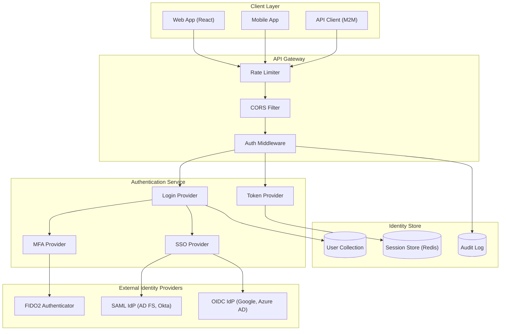
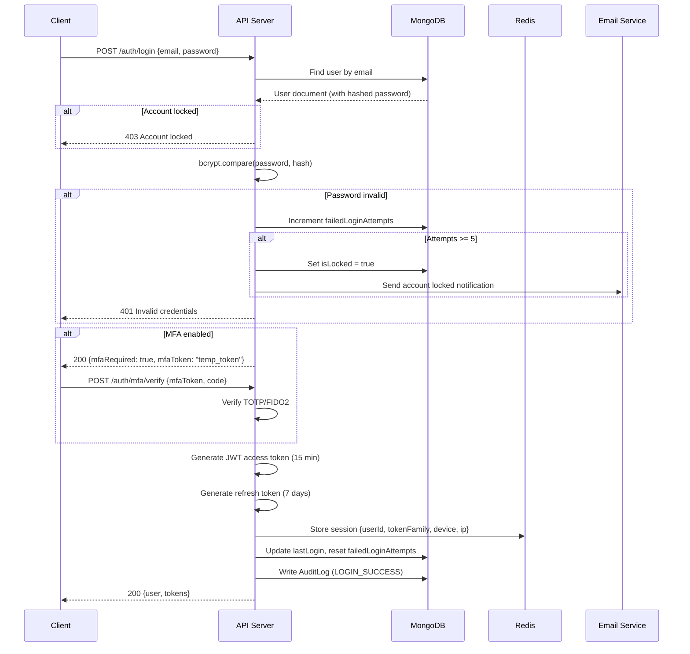
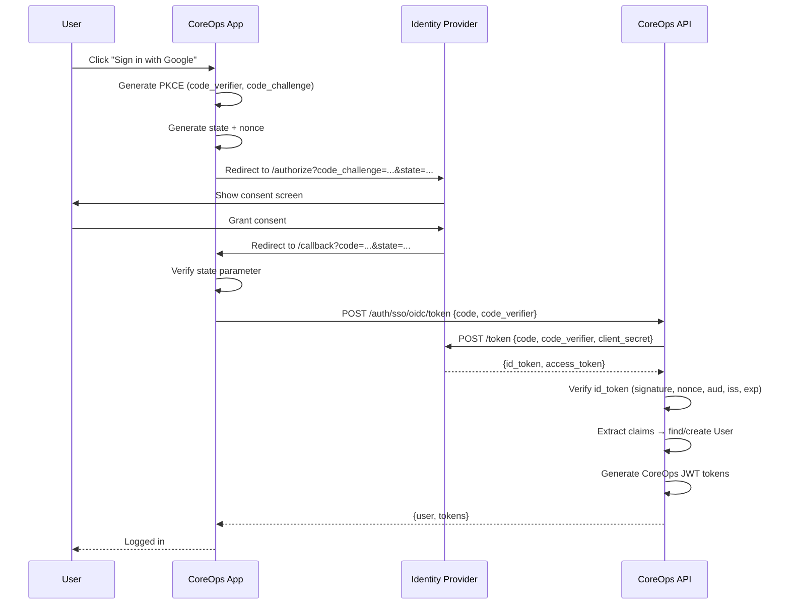
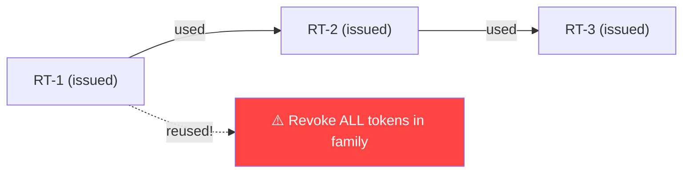
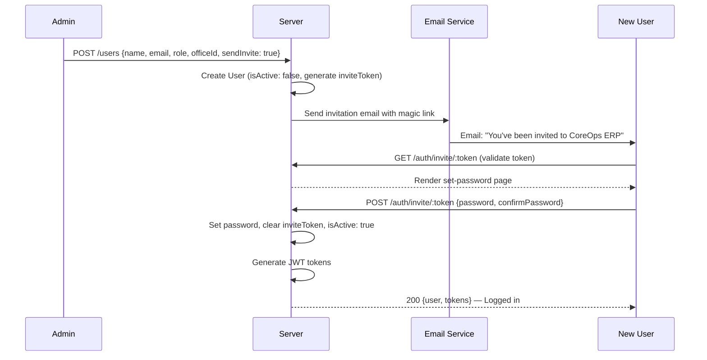

# 05: Authentication & Identity — CoreOps ERP v3.0

> **Standards**: OAuth 2.1 · OpenID Connect · FIDO2/WebAuthn · OWASP ASVS Level 2  
> **Architecture**: Zero Trust · Defense in Depth · Principle of Least Privilege

---

## 5.1 Architecture Overview



---

## 5.2 Authentication Methods

### 5.2.1 Email + Password (Primary)

The default authentication method for all users.

**Password Requirements**:
- Minimum 8 characters, maximum 128 characters
- At least 1 uppercase, 1 lowercase, 1 digit, 1 special character
- Cannot match any of the last 5 passwords
- Checked against breached password databases (HaveIBeenPwned k-anonymity API)
- Bcrypt hashing with 12 salt rounds

**Login Flow**:



### 5.2.2 Multi-Factor Authentication (MFA)

#### TOTP (Time-based One-Time Password)

- Algorithm: SHA-1, 6-digit codes, 30-second step
- Compatible with Google Authenticator, Authy, 1Password
- Setup generates QR code with `otpauth://totp/CoreOps:email?secret=BASE32&issuer=CoreOps`

#### FIDO2 / WebAuthn (Passwordless)

- Hardware security keys (YubiKey, Titan)
- Platform authenticators (Windows Hello, Touch ID, Face ID)
- Passkeys (synced across devices via iCloud/Google)

**Registration Flow**:
```javascript
// 1. Server generates challenge
GET /auth/webauthn/register/options → { challenge, rp, user, pubKeyCredParams }

// 2. Client creates credential
const credential = await navigator.credentials.create({ publicKey: options });

// 3. Server verifies and stores
POST /auth/webauthn/register/verify → { credentialId, publicKey, counter }
```

**Authentication Flow**:
```javascript
// 1. Server generates assertion challenge
GET /auth/webauthn/login/options → { challenge, allowCredentials }

// 2. Client signs challenge
const assertion = await navigator.credentials.get({ publicKey: options });

// 3. Server verifies signature
POST /auth/webauthn/login/verify → { user, tokens }
```

#### Backup Codes

- 10 single-use backup codes generated during MFA setup
- Format: `XXXX-XXXX` (8 alphanumeric characters)
- Stored as bcrypt hashes in the User document
- Users can regenerate (invalidates all previous codes)

### 5.2.3 Enterprise SSO

#### SAML 2.0

For enterprise customers using Active Directory Federation Services, Okta, or OneLogin.

| Configuration | Value |
|--------------|-------|
| Service Provider Entity ID | `https://api.coreops.app/saml/metadata` |
| ACS URL | `https://api.coreops.app/v1/auth/sso/saml/callback` |
| SLO URL | `https://api.coreops.app/v1/auth/sso/saml/logout` |
| NameID Format | `urn:oasis:names:tc:SAML:1.1:nameid-format:emailAddress` |
| Signed Assertions | Required |
| Encrypted Assertions | Supported |
| Certificate | RSA 2048-bit, rotated annually |

**Attribute Mapping**:

| SAML Attribute | CoreOps Field |
|---------------|---------------|
| `email` or `nameID` | `user.email` |
| `displayName` | `user.name` |
| `groups` | Role mapping (configurable) |
| `department` | `employee.departmentId` |

#### OpenID Connect (OIDC)

For Google Workspace, Microsoft Entra ID (Azure AD), and custom OIDC providers.

| Configuration | Value |
|--------------|-------|
| Client Type | Confidential |
| Grant Type | Authorization Code + PKCE |
| Response Type | `code` |
| Scopes | `openid profile email` |
| Redirect URI | `https://app.coreops.app/auth/callback` |
| Token Endpoint Auth | `client_secret_post` |

**Flow**:



---

## 5.3 Token Architecture

### Access Token (JWT)

| Property | Value |
|----------|-------|
| Algorithm | RS256 (RSA + SHA-256) |
| Lifetime | 15 minutes |
| Storage | Memory (React state) — **never localStorage** |
| Rotation | On each `/auth/refresh` call |

**Claims**:
```json
{
  "sub": "65a12345...",
  "email": "admin@coreops.app",
  "name": "Tirth Goyani",
  "role": "SUPER_ADMIN",
  "officeId": null,
  "permissions": ["canApproveTickets", "canManageAssets", "canManageUsers"],
  "sessionId": "sess_abc123...",
  "iat": 1708000000,
  "exp": 1708000900,
  "iss": "https://api.coreops.app",
  "aud": "coreops-web"
}
```

### Refresh Token

| Property | Value |
|----------|-------|
| Format | Opaque (random 256-bit), stored hashed in Redis |
| Lifetime | 7 days (30 days with "Remember Me") |
| Storage | HTTP-only, Secure, SameSite=Strict cookie |
| Rotation | **Automatic** — every use issues a new refresh token |

### Token Rotation (Refresh Token Reuse Detection)



**How it works**:
1. Each refresh token belongs to a **token family** (set on login)
2. When a refresh token is used, it's invalidated and a new one is issued
3. If a previously-used refresh token is reused (theft indicator):
   - **All tokens in the family are revoked immediately**
   - User is logged out of all sessions
   - Audit log entry: `TOKEN_REUSE_DETECTED`
   - Email alert sent to user

---

## 5.4 Session Management

### Session Store (Redis)

```
session:{sessionId} → {
  userId, tokenFamily, deviceInfo, ipAddress,
  userAgent, location, createdAt, lastActivity,
  mfaVerified, isActive
}
TTL: 7 days (or 30 days with rememberMe)
```

### Session Policies

| Policy | Value | Description |
|--------|-------|-------------|
| Max concurrent sessions | 5 per user | Oldest session revoked on 6th login |
| Idle timeout | 30 minutes | Extended on activity |
| Absolute timeout | 24 hours | Forces re-authentication |
| Remember Me timeout | 30 days | Used with persistent cookie |
| Session lock | After 15 min idle | Requires password/biometric to unlock |

### Session Events

| Event | Trigger | Action |
|-------|---------|--------|
| `SESSION_CREATED` | Login | Create Redis entry, audit log |
| `SESSION_REFRESHED` | Token refresh | Update `lastActivity` |
| `SESSION_EXPIRED` | Timeout | Remove Redis entry, audit log |
| `SESSION_REVOKED` | Explicit logout / admin action | Remove Redis entry, notify client via WebSocket |
| `SESSION_LOCKED` | Idle timeout | Set `locked: true`, require re-auth |
| `SESSIONS_ALL_REVOKED` | Password change / security event | Revoke all sessions for user |

### Device Trust

Recognized devices skip step-up authentication for 30 days:

```json
{
  "deviceId": "fingerprint_hash",
  "deviceName": "Chrome on Windows (Mumbai)",
  "trusted": true,
  "trustedUntil": "2026-03-15T00:00:00Z",
  "firstSeen": "2026-02-15T10:30:00Z",
  "lastSeen": "2026-02-15T10:30:00Z"
}
```

---

## 5.5 Role-Based Access Control (RBAC)

### Role Hierarchy

```
SUPER_ADMIN ─── Full system access (cross-office)
    │
    ├── MANAGER ─── Office-level management
    │       │
    │       ├── TECHNICIAN ─── Field operations + maintenance
    │       │
    │       └── STAFF ─── Standard office operations
    │
    └── VIEWER ─── Read-only access
```

### Permission Matrix

| Permission | SUPER_ADMIN | MANAGER | TECHNICIAN | STAFF | VIEWER |
|-----------|:-----------:|:-------:|:----------:|:-----:|:------:|
| **Users** |
| View users | ✅ | ✅ (own office) | ❌ | ❌ | ❌ |
| Create/edit users | ✅ | ✅ (own office) | ❌ | ❌ | ❌ |
| Change roles | ✅ | ❌ | ❌ | ❌ | ❌ |
| Delete users | ✅ | ❌ | ❌ | ❌ | ❌ |
| **Offices** |
| View all offices | ✅ | ✅ (own tree) | ✅ (own) | ✅ (own) | ✅ (own) |
| Create/edit offices | ✅ | ❌ | ❌ | ❌ | ❌ |
| **Assets** |
| View assets | ✅ | ✅ | ✅ | ✅ | ✅ |
| Create/edit assets | ✅ | ✅ | ❌ | ❌ | ❌ |
| Delete assets | ✅ | ✅ | ❌ | ❌ | ❌ |
| Transfer assets | ✅ | ✅ | ❌ | ❌ | ❌ |
| **Maintenance** |
| View tickets | ✅ | ✅ | ✅ (assigned) | ✅ | ✅ |
| Create tickets | ✅ | ✅ | ✅ | ✅ | ❌ |
| Assign technicians | ✅ | ✅ | ❌ | ❌ | ❌ |
| Approve tickets | ✅ | ✅ (within limit) | ❌ | ❌ | ❌ |
| Add work logs | ✅ | ✅ | ✅ | ❌ | ❌ |
| **Inventory** |
| View inventory | ✅ | ✅ | ✅ | ✅ | ✅ |
| Create/edit items | ✅ | ✅ | ❌ | ❌ | ❌ |
| Adjust stock | ✅ | ✅ | ❌ | ❌ | ❌ |
| **Procurement** |
| View POs | ✅ | ✅ | ❌ | ✅ | ✅ |
| Create POs | ✅ | ✅ | ❌ | ❌ | ❌ |
| Approve POs | ✅ | ✅ (within limit) | ❌ | ❌ | ❌ |
| Manage vendors | ✅ | ✅ | ❌ | ❌ | ❌ |
| **Finance** |
| View transactions | ✅ | ✅ | ❌ | ❌ | ❌ |
| Create transactions | ✅ | ✅ | ❌ | ❌ | ❌ |
| Post journal entries | ✅ | ✅ | ❌ | ❌ | ❌ |
| View reports | ✅ | ✅ | ❌ | ❌ | ❌ |
| **HR** |
| View employees | ✅ | ✅ (own dept) | ❌ | ❌ | ❌ |
| Manage employees | ✅ | ✅ (own dept) | ❌ | ❌ | ❌ |
| Approve leaves | ✅ | ✅ | ❌ | ❌ | ❌ |
| View own profile | ✅ | ✅ | ✅ | ✅ | ✅ |
| **System** |
| View audit logs | ✅ | ❌ | ❌ | ❌ | ❌ |
| System settings | ✅ | ❌ | ❌ | ❌ | ❌ |
| AI insights | ✅ | ✅ | ❌ | ❌ | ❌ |

### Approval Limits

Managers have monetary approval limits set per user:

| Field | Values | Description |
|-------|--------|-------------|
| `approvalLimit` | `0` | Cannot approve any amounts |
| `approvalLimit` | `50000` | Can approve up to ₹50,000 |
| `approvalLimit` | `-1` | Unlimited approval authority |

Items exceeding a manager's limit auto-escalate to the next level or SUPER_ADMIN.

---

## 5.6 API Key Management

For machine-to-machine (M2M) integration, IoT devices, and third-party systems.

### Key Properties

| Property | Description |
|----------|-------------|
| Format | `sk_live_` prefix + 48 random chars |
| Hash storage | SHA-256 (only hash stored, full key shown once) |
| Scopes | Granular per-resource permissions |
| Rate limit | 500 req/min (separate from user limits) |
| Expiry | 1 year (configurable, auto-rotation reminders) |
| IP restriction | Optional allowlist |

### API Key Scopes

```json
{
  "name": "IoT Sensor Ingestion",
  "keyPrefix": "sk_live_abc123...",
  "scopes": ["iot:write", "assets:read"],
  "ipAllowlist": ["203.0.113.0/24"],
  "officeId": "65a67890...",
  "expiresAt": "2027-02-15T00:00:00Z",
  "lastUsed": "2026-02-15T10:30:00Z",
  "usageCount": 145230
}
```

### Available Scopes

| Scope | Description |
|-------|-------------|
| `assets:read`, `assets:write` | Asset CRUD |
| `maintenance:read`, `maintenance:write` | Maintenance tickets |
| `inventory:read`, `inventory:write` | Inventory operations |
| `iot:read`, `iot:write` | IoT sensor data |
| `finance:read` | Financial data (read-only) |
| `reports:read` | Report generation |
| `webhook:manage` | Webhook configuration |

---

## 5.7 Security Controls

### Account Lockout

| Parameter | Value |
|-----------|-------|
| Failed attempts threshold | 5 |
| Lockout duration | 30 minutes (auto-unlock) |
| Permanent lock | After 15 failed attempts (admin unlock required) |
| Notification | Email to user + admin on lockout |

### Brute Force Protection

| Layer | Mechanism |
|-------|-----------|
| Application | Progressive delays: 0s → 1s → 2s → 4s → 8s |
| Rate limiting | 10 login attempts per IP per minute |
| CAPTCHA | Required after 3 failed attempts |
| IP blocking | Temporary block after 50 attempts per hour |

### Password Policy

| Rule | Requirement |
|------|------------|
| Minimum length | 8 characters |
| Maximum length | 128 characters |
| Complexity | Upper + lower + digit + special |
| History check | Cannot reuse last 5 passwords |
| Breach check | HaveIBeenPwned k-anonymity |
| Expiry | 90 days (configurable per office) |
| First-login change | Required for invited users |

### CORS Configuration

```javascript
{
  origin: [
    'https://app.coreops.app',
    'https://staging.coreops.app',
    /\.coreops\.app$/,
  ],
  methods: ['GET', 'POST', 'PUT', 'PATCH', 'DELETE', 'OPTIONS'],
  allowedHeaders: ['Authorization', 'Content-Type', 'X-Office-Id', 'X-Request-Id'],
  credentials: true,
  maxAge: 86400,
}
```

### HTTP Security Headers

| Header | Value |
|--------|-------|
| `Strict-Transport-Security` | `max-age=31536000; includeSubDomains; preload` |
| `X-Content-Type-Options` | `nosniff` |
| `X-Frame-Options` | `DENY` |
| `X-XSS-Protection` | `0` (disabled — use CSP instead) |
| `Content-Security-Policy` | `default-src 'self'; script-src 'self'; style-src 'self' 'unsafe-inline'` |
| `Referrer-Policy` | `strict-origin-when-cross-origin` |
| `Permissions-Policy` | `camera=(), microphone=(), geolocation=(self)` |

### Data Protection

| Data Type | Protection |
|-----------|-----------|
| Passwords | Bcrypt (12 rounds) |
| Refresh tokens | SHA-256 hash |
| API keys | SHA-256 hash (prefix shown) |
| MFA secrets | AES-256-GCM encryption at rest |
| Backup codes | Bcrypt hash |
| PII (salary, bank) | `select: false` on schema + field-level encryption |
| Tokens in transit | TLS 1.3 only |

---

## 5.8 Audit Trail

Every authentication event is logged to the `AuditLog` collection:

### Authentication Events

| Event | Trigger | Severity |
|-------|---------|----------|
| `LOGIN_SUCCESS` | Successful login | INFO |
| `LOGIN_FAILED` | Invalid credentials | WARNING |
| `LOGIN_MFA_REQUIRED` | MFA challenge issued | INFO |
| `LOGIN_MFA_SUCCESS` | MFA verification passed | INFO |
| `LOGIN_MFA_FAILED` | Invalid MFA code | WARNING |
| `LOGIN_SSO` | SSO authentication | INFO |
| `LOGOUT` | User logout | INFO |
| `TOKEN_REFRESHED` | Token rotation | INFO |
| `TOKEN_REUSE_DETECTED` | Refresh token replay attack | CRITICAL |
| `PASSWORD_CHANGED` | User changed password | INFO |
| `PASSWORD_RESET_REQUESTED` | Reset email sent | INFO |
| `PASSWORD_RESET_COMPLETED` | Password reset via token | INFO |
| `ACCOUNT_LOCKED` | Too many failed attempts | WARNING |
| `ACCOUNT_UNLOCKED` | Admin unlocked account | INFO |
| `MFA_ENABLED` | User enabled MFA | INFO |
| `MFA_DISABLED` | User disabled MFA | WARNING |
| `API_KEY_CREATED` | New API key generated | INFO |
| `API_KEY_REVOKED` | API key revoked | INFO |
| `SESSION_REVOKED` | Admin revoked session | WARNING |
| `ROLE_CHANGED` | User role updated | WARNING |
| `PERMISSION_DENIED` | Unauthorized access attempt | WARNING |
| `SUSPICIOUS_ACTIVITY` | Anomalous login pattern | CRITICAL |

### Log Entry Structure

```json
{
  "action": "LOGIN_SUCCESS",
  "userId": "65a12345...",
  "entityType": "User",
  "entityId": "65a12345...",
  "severity": "INFO",
  "ipAddress": "203.0.113.42",
  "userAgent": "Mozilla/5.0 (Windows NT 10.0; Win64; x64) AppleWebKit/537.36",
  "location": { "city": "Surat", "country": "IN", "coordinates": { "lat": 21.17, "lng": 72.83 } },
  "metadata": {
    "method": "email_password",
    "mfaUsed": true,
    "mfaMethod": "totp",
    "sessionId": "sess_abc123...",
    "deviceInfo": { "os": "Windows 10", "browser": "Chrome 122" }
  },
  "timestamp": "2026-02-15T10:30:00Z"
}
```

---

## 5.9 Setup Wizard (First-Time Configuration)

The setup wizard runs on first deployment when no users exist.

### Wizard Steps


| Step | Endpoint | Description |
|------|----------|-------------|
| 1. Admin Account | `POST /auth/register` | Create SUPER_ADMIN (name, email, password) |
| 2. Organization | `POST /offices` | Create headquarters office (name, code, country, currency) |
| 3. Office Config | `PATCH /offices/:id` | Configure settings (thresholds, depreciation method) |
| 4. Modules | `POST /system/config` | Enable/disable modules (CMMS, Inventory, Finance, etc.) |
| 5. Data Import | `POST /import/csv` | Optional: import assets, inventory, employees from CSV |
| 6. Launch | `POST /system/activate` | Mark setup complete, generate sample data (optional) |

---

## 5.10 User Invitation Flow



- Invite tokens expire in **72 hours**
- Admin can resend invitations via `POST /users/:id/invite`
- Expired invitations are cleaned up by a daily cron job

---

## 5.11 Compliance & Standards

### Regulatory Compliance

| Standard | Scope | Implementation |
|----------|-------|----------------|
| **OWASP ASVS Level 2** | Application security | Credential storage, session management, input validation |
| **SOC 2 Type II** | Security controls | Audit logs, access controls, encryption |
| **GDPR** | Data privacy (EU) | Right to erasure, data portability, consent management |
| **IT Act 2000 (India)** | Data protection | Encryption at rest/transit, access controls |
| **ISO 27001** | Information security | ISMS alignment |

### Data Residency

| Region | Data Center | Regulations |
|--------|-------------|-------------|
| India | Mumbai (AWS ap-south-1) | IT Act 2000, RBI guidelines |
| EU | Frankfurt (AWS eu-central-1) | GDPR |
| US | Virginia (AWS us-east-1) | SOC 2, HIPAA-eligible |

### Security Scanning

| Tool | Frequency | Target |
|------|-----------|--------|
| Dependency audit (`npm audit`) | Every build | Supply chain |
| SAST (SonarQube / Semgrep) | Every PR | Source code |
| DAST (OWASP ZAP) | Weekly | Running API |
| Penetration testing | Bi-annual | Full system |
| Secret scanning | Every commit | Credentials in code |

---

## 5.12 Security Quick Reference

### Token Lifetimes

| Token | Lifetime | Storage | Rotation |
|-------|----------|---------|----------|
| Access (JWT) | 15 min | Memory | On refresh |
| Refresh | 7d / 30d | HTTP-only cookie | Every use |
| Invite | 72 hours | DB | Single-use |
| Password Reset | 1 hour | DB | Single-use |
| MFA Setup | 10 min | Memory | Single-use |
| API Key | 1 year | DB (hashed) | Manual |

### Critical Security Checklist

- [x] Passwords hashed with bcrypt (12 rounds)
- [x] JWTs signed with RS256 (asymmetric)
- [x] Refresh tokens stored as HTTP-only, Secure, SameSite cookies
- [x] Refresh token rotation with reuse detection
- [x] Rate limiting on auth endpoints (10 req/min)
- [x] Account lockout after 5 failed attempts
- [x] CORS restricted to known origins
- [x] All sensitive fields `select: false` in Mongoose
- [x] Audit logging for all auth events
- [x] HTTPS enforced with HSTS preload
- [x] CSP headers preventing XSS
- [x] API keys hashed with SHA-256 (prefix-only display)
- [x] MFA secrets encrypted at rest (AES-256-GCM)
- [x] Password breach checking via k-anonymity
- [x] Session idle + absolute timeouts
